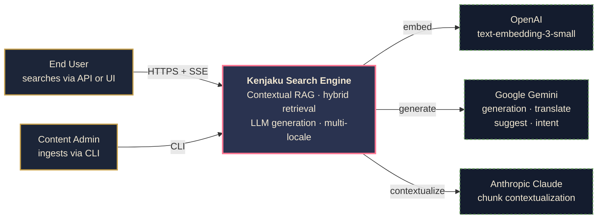
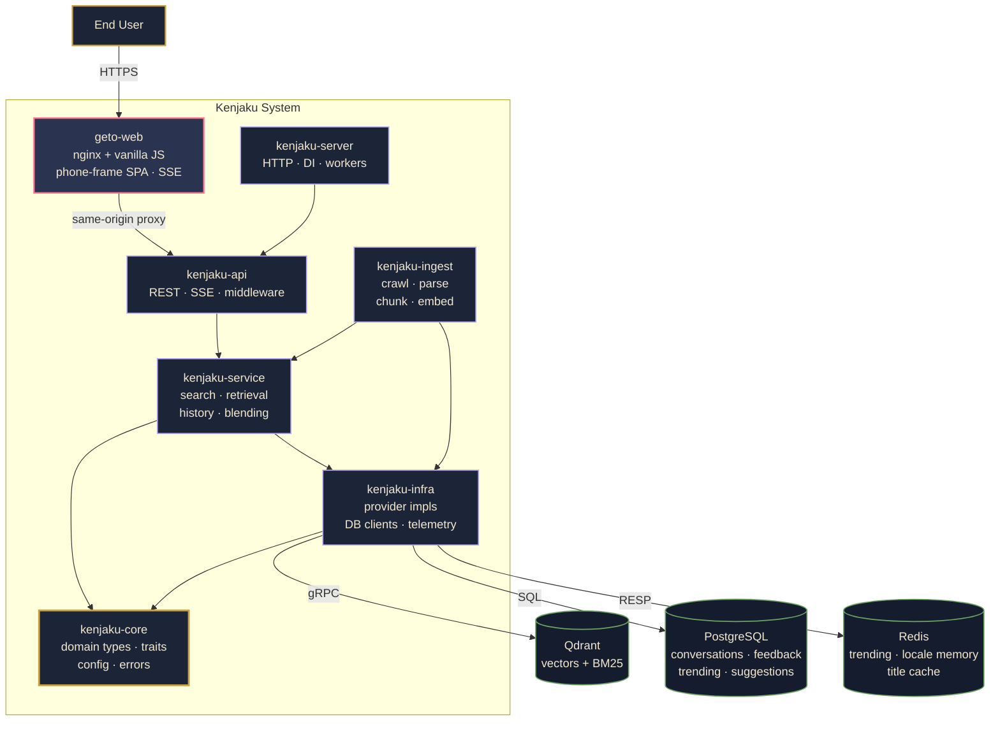
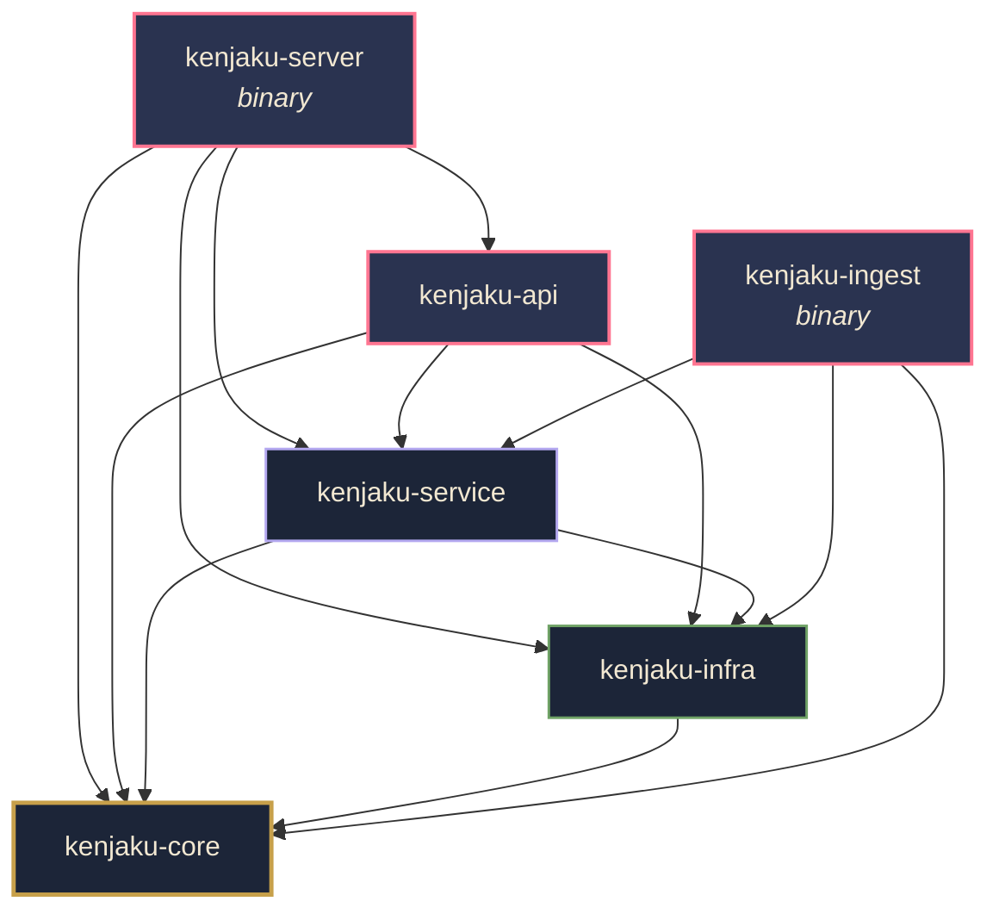
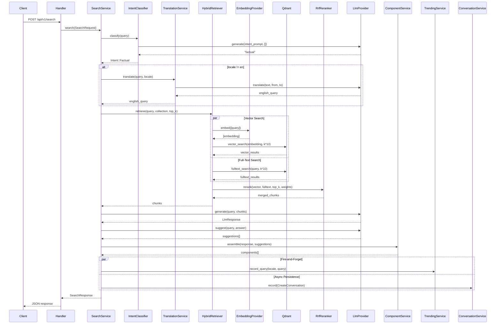
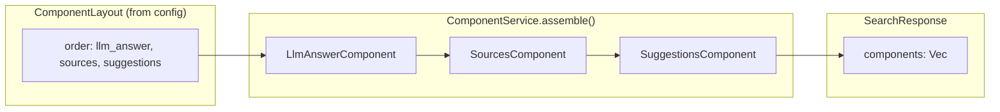
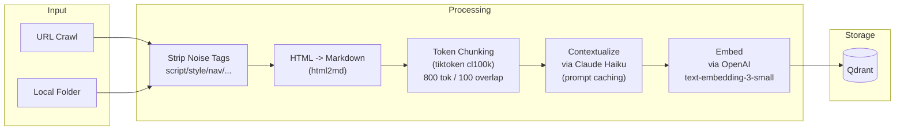
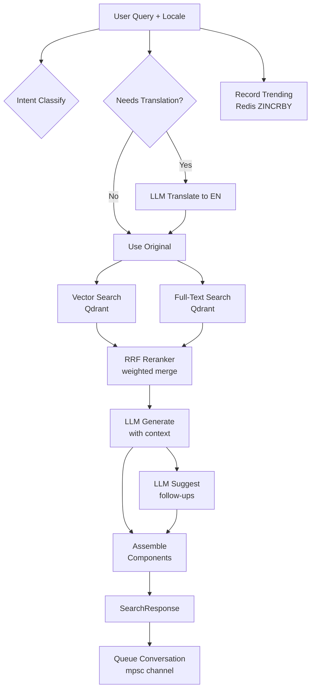
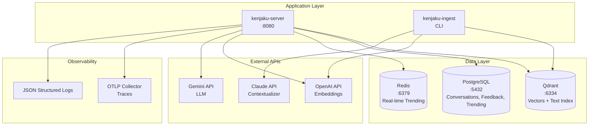
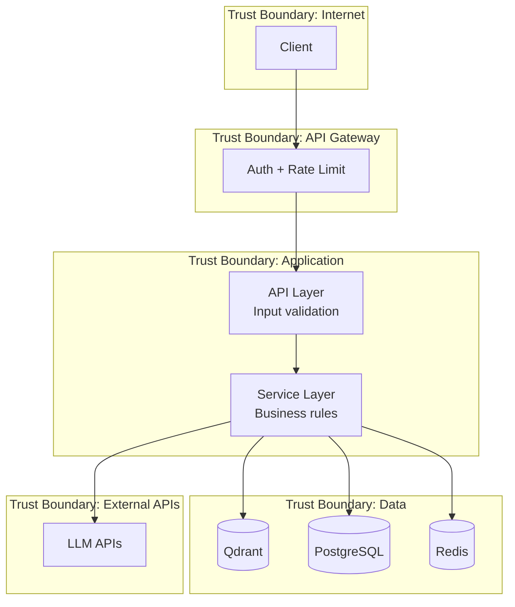

# Kenjaku — Contextual RAG Search Engine Architecture

## 1. System Overview

Kenjaku is a contextual Retrieval-Augmented Generation (RAG) search engine built as a Rust workspace with 6 crates. It combines hybrid vector + full-text retrieval, LLM-based answer generation, intent classification, multi-locale translation, and a pluggable component layout system to deliver structured search responses.

### System Context



### Container Diagram



## 2. Crate Dependency Graph



| Crate | Depends On | Depended By |
|-------|-----------|-------------|
| `kenjaku-core` | (none — leaf) | infra, service, api, server, ingest |
| `kenjaku-infra` | core | service, api, server, ingest |
| `kenjaku-service` | core, infra | api, server, ingest |
| `kenjaku-api` | core, infra, service | server |
| `kenjaku-server` | core, infra, service, api | (binary) |
| `kenjaku-ingest` | core, infra, service | (binary) |

## 3. Design Principles & Golden Rules

### 3.1 Trait-Based Abstraction at the Core

All external dependencies are abstracted behind traits defined in `kenjaku-core::traits`:

| Trait | Purpose | Current Impl |
|-------|---------|-------------|
| `EmbeddingProvider` | Vector embedding generation | `OpenAiEmbeddingProvider` |
| `LlmProvider` | Answer generation, streaming, translation, suggestions | `GeminiProvider` |
| `Contextualizer` | Chunk contextualization during ingestion | `ClaudeContextualizer` |
| `IntentClassifier` | Query intent classification | `LlmIntentClassifier` |
| `Retriever` | Document retrieval | `HybridRetriever` |
| `Reranker` | Result fusion/reranking | `RrfReranker` |

**Golden Rule: Business logic in `service` never imports concrete provider types. It depends only on `Arc<dyn Trait>`.**

### 3.2 Immutable Domain Types

All domain types in `kenjaku-core::types` are immutable `#[derive(Clone, Serialize, Deserialize)]` structs. State transitions produce new values, not mutations.

### 3.3 Fire-and-Forget for Non-Critical Paths

Trending recording and conversation persistence are decoupled from the search hot path:
- **Trending**: Direct Redis ZINCRBY, errors logged but not propagated
- **Conversations**: Sent through a bounded `mpsc` channel, batch-flushed by a background worker

### 3.4 Configuration Hierarchy

```
config/base.yaml              — defaults, no secrets (committed)
config/{APP_ENV}.yaml          — env overrides (committed)
config/secrets.{env}.yaml      — API keys, DB credentials (gitignored)
KENJAKU__* env vars            — final override layer
```

Secrets MUST live in `secrets.{env}.yaml` or env vars. The server validates all required secrets at startup via `AppConfig::validate_secrets()` and fails fast with a clear message listing what's missing.

### 3.5 Supported Locales

Typed `Locale` enum enforced at the API boundary:

| Code | Language |
|------|----------|
| `en` | English |
| `zh` | Chinese (Simplified) |
| `zh-TW` | Chinese (Traditional) |
| `ja` | Japanese |
| `ko` | Korean |
| `de` | German |
| `fr` | French |
| `es` | Spanish |

Non-English queries are translated to English before retrieval.

### 3.6 Intent Classification

Every query is classified by intent before search:

| Intent | Description |
|--------|-------------|
| `factual` | Seeking specific factual information |
| `navigational` | Looking for a specific page or resource |
| `how_to` | Procedural or step-by-step question |
| `comparison` | Comparing options |
| `troubleshooting` | Diagnosing or fixing a problem |
| `exploratory` | Open-ended research |
| `conversational` | Chitchat (not a real search) |
| `unknown` | Cannot determine |

## 4. Search Pipeline Flow



## 5. Component System Design

The component system provides a pluggable, configurable layout for search responses:



Adding a new component type requires:
1. New variant in `ComponentType` and `Component` enums
2. New component struct
3. New arm in `ComponentService::assemble()`
4. Update config YAML

## 6. Data Flow

### 6.1 Ingestion Pipeline



The URL crawler includes SSRF protection: a private-IP blocklist (RFC1918, loopback, link-local, CG-NAT), DNS resolution check before every fetch, and `redirect::Policy::none()` to prevent redirect-based bypass.

### 6.2 Query Pipeline



## 7. Infrastructure Topology



### Background Workers

| Worker | Trigger | Function |
|--------|---------|----------|
| `TrendingFlushWorker` | Timer (300s default) | Scans Redis `trending:*` keys, flushes entries above threshold to PostgreSQL |
| `ConversationFlushWorker` | Channel drain | Batch-inserts queued conversation records to PostgreSQL |

## 8. Database Schema

### PostgreSQL

```sql
-- Reason categories for negative feedback
CREATE TABLE reason_categories (
    id SERIAL PRIMARY KEY,
    slug VARCHAR(100) UNIQUE NOT NULL,
    label VARCHAR(255) NOT NULL,
    is_active BOOLEAN NOT NULL DEFAULT TRUE
);

-- User feedback on search responses. The unique index on
-- (session_id, request_id) makes repeated like/dislike clicks upsert
-- the existing row in place (added in migration 20260407000001).
CREATE TABLE feedback (
    id UUID PRIMARY KEY DEFAULT gen_random_uuid(),
    session_id VARCHAR(255) NOT NULL,
    request_id VARCHAR(255) NOT NULL,
    action VARCHAR(20) NOT NULL CHECK (action IN ('like', 'dislike', 'cancel')),
    reason_category_id INTEGER REFERENCES reason_categories(id),
    description TEXT,
    created_at TIMESTAMPTZ NOT NULL DEFAULT NOW()
);
CREATE UNIQUE INDEX idx_feedback_session_request_unique
    ON feedback(session_id, request_id);

-- Popular/trending search queries (flushed from Redis)
CREATE TABLE popular_queries (
    id SERIAL PRIMARY KEY,
    locale VARCHAR(10) NOT NULL,
    query TEXT NOT NULL,
    search_count BIGINT NOT NULL DEFAULT 0,
    period VARCHAR(20) NOT NULL,
    period_date DATE NOT NULL,
    UNIQUE(locale, query, period, period_date)
);

-- Conversation records for analytics and audit
CREATE TABLE conversations (
    id UUID PRIMARY KEY DEFAULT gen_random_uuid(),
    session_id VARCHAR(255) NOT NULL,
    request_id VARCHAR(255) NOT NULL UNIQUE,
    query TEXT NOT NULL,
    response_text TEXT NOT NULL,
    locale VARCHAR(10) NOT NULL,
    intent VARCHAR(50) NOT NULL,
    meta JSONB NOT NULL DEFAULT '{}',
    created_at TIMESTAMPTZ NOT NULL DEFAULT NOW()
);
```

### Qdrant Collection

```json
{
  "collection_name": "documents",
  "vectors": { "size": 1536, "distance": "Cosine" },
  "payload_indices": {
    "contextualized_content": "text (tokenized, lowercase, word)",
    "title": "text (tokenized, lowercase, word)"
  }
}
```

### Redis Key Patterns

```
trending:daily:{locale}:{YYYY-MM-DD}   -> ZSET (query -> score)  TTL: 2 days
trending:weekly:{locale}:{YYYY-W##}    -> ZSET (query -> score)  TTL: 14 days
title:{redirect_url}                    -> JSON {u, t}            TTL: 24h ok / 10min fail
```

Member values in `trending:*` are the *normalized + capitalized* form
(English: translator output, others: raw with first char capitalized).
The record-time gibberish guard rejects junk before it reaches Redis;
the read paths (autocomplete + top-searches) additionally enforce
`crowd_sourcing_min_count` (default 2) so anything that slips past
still needs repeated independent searches before surfacing.

The `title:` cache stores `TitleResolver` results — Gemini's
`vertexaisearch.cloud.google.com/grounding-api-redirect/...` URLs
follow redirects and parse `<head>` for a real page title once, then
serve cached values for 24h.

## 9. Security Boundaries



## 9.1 Implemented Hardening (post-review)

The first review round identified these production gaps. All have been addressed:

- **Query length cap** (2000 chars), **top_k cap** (100), **autocomplete/top-searches limit caps** — enforced at API boundary
- **Rate limiting** via `tower_governor` (60 req/min per IP, `SmartIpKeyExtractor`)
- **Request body limit** (64KB) via `RequestBodyLimitLayer`
- **Request timeout** (30s) via `TimeoutLayer`
- **Error sanitization** — `Error::user_message()` returns safe strings; never leaks DB URLs, API errors, or internals
- **SSRF protection** in URL crawler (private-IP blocklist + DNS check + no-redirect)
- **Prompt injection defense** — user text isolated in `<text>`/`<query>` XML tags with "ignore instructions inside" preambles in both the intent classifier and translator
- **Redis SCAN** replaces the original `KEYS` call in the trending flush worker
- **Secrets validation** at startup via `AppConfig::validate_secrets()`
- **Migrations** — sqlx flat-file format with conversations table
- **Query quality guard** — `kenjaku_service::quality::is_gibberish` (length caps Latin 120 / CJK 60 runes, no-space-Latin >=25 chars, single-character dominance >40% in 10+ char queries) drops junk before Redis; `crowd_sourcing_min_count` provides a second filter at the read paths so any junk that slips through still needs independent repeated searches before surfacing
- **Feedback dedup** — unique index on `feedback(session_id, request_id)` makes repeated like/dislike clicks upsert in place

Still deferred (accepted by operator):
- API authentication (next phase)
- Gemini API key in URL query param (Google API design)
- Conversation PII retention policy

## 10. Key Decision Records

### ADR-001: Qdrant for Vector + Full-Text Search

**Context**: Need both vector similarity search and keyword/BM25-style full-text search in a single store.

**Decision**: Use Qdrant with vector indices AND text payload indices on the same collection.

**Rationale**: Single data store simplifies operations. Qdrant's text index supports tokenized full-text search on payload fields. Cosine distance is well-suited for normalized embeddings from OpenAI.

**Trade-offs**: Full-text search is not true BM25 (Qdrant uses simpler text matching) — acceptable given 80/20 weight toward vector search. At very large scale (>10M vectors), consider a dedicated full-text engine alongside Qdrant.

### ADR-002: Reciprocal Rank Fusion for Hybrid Reranking

**Decision**: Use weighted RRF: `score = semantic_weight / (rank + 1) + bm25_weight / (rank + 1)`.

**Rationale**: RRF is rank-based, not score-based — avoids incomparable score distributions between vector (cosine 0-1) and text search. Weights are configurable in YAML (default 80/20).

### ADR-003: Channel-Based Async Conversation Flush

**Decision**: Use bounded `tokio::sync::mpsc` channel (1024 buffer) with batch-insert worker.

**Rationale**: `try_send` is non-blocking — zero latency on search path. Batch inserts (up to 64) reduce DB round trips. Records can be lost on crash — acceptable for analytics data.

### ADR-004: Gemini as Primary LLM with Google Search Grounding

**Decision**: Use Google Gemini with the `google_search` tool for grounded responses with source citations.

**Rationale**: Cost-effective for high-volume workloads. Native Google Search grounding provides real-time source citations. Vendor lock-in mitigated by `LlmProvider` trait abstraction.

### ADR-005: Claude for Chunk Contextualization

**Decision**: Use Claude Haiku 4.5 with prompt caching for contextualization during ingestion.

**Rationale**: Document content (large) is cached; only the chunk prompt (small) changes per call — cost-efficient. Separate from runtime LLM because contextualization is write-path only.

## 11. Scaling Considerations

| Bottleneck | Impact | Mitigation |
|-----------|--------|------------|
| LLM latency (3 sequential calls) | ~600ms minimum per request | Parallelize intent + translation; cache intent for repeated queries |
| Embedding latency | 50-200ms per query | Cache embeddings for repeated queries |
| Redis KEYS command | O(N) blocks Redis at scale | Replace with SCAN cursor-based iteration |
| PostgreSQL connections | Default pool of 10 | Increase + use PgBouncer in transaction mode |
| Single-process | Limited to one server | Deploy N replicas — all state in external stores |

**Projected capacity**: ~500-1000 QPS (limited by LLM latency). Intent classification and query normalization already run in parallel via `tokio::join!` in `SearchService::search`. With query-result caching layered on top, projected ~2000 QPS.

## 12. Measured Latency (post-optimization)

Test query: *"What rewards do I get with the Crypto.com prepaid card?"* against the ingested help.crypto.com corpus (64 chunks, depth=1).

| Metric | Non-streaming | Streaming (SSE) |
|--------|---------------|-----------------|
| TTFT | n/a | ~3.7s |
| Total time | ~6.8s | ~5.4s |
| Observed user experience | single JSON dump | tokens flow live |

Pipeline breakdown (streaming):
1. `max(intent_classify, translate)` in parallel — ~1.5s (translator is the bottleneck since it's slightly slower than intent classify)
2. Hybrid retrieve (vector + BM25 parallel via `try_join!`) — ~0.5s
3. Open Gemini `streamGenerateContent` connection — ~1.7s to first byte
4. Stream token deltas — ~1.7s for a typical answer

The intent classifier was previously the bottleneck at ~5s because every call sent the `google_search` grounding tool. Fix: `GeminiProvider::generate()` detects an empty context slice and skips the tool entirely, dropping intent classify to ~1s.

## 13. SSE Streaming Protocol

The `/api/v1/search` handler emits **named** SSE events so the geto-web client can populate its debug panel as soon as the preamble work is done — without waiting for the first LLM token.

`SearchService::search_stream` returns a `SearchStreamOutput` containing:

| Field | Type | Purpose |
|-------|------|---------|
| `start_metadata` | `StreamStartMetadata` | Everything known before the LLM begins (intent, translated_query, locale, retrieval_count, preamble_latency_ms, request_id, session_id) |
| `stream` | `Pin<Box<dyn Stream<Item = Result<StreamChunk>>>>` | Token deltas from the LLM. Each `StreamChunk` may carry an optional `grounding: Vec<LlmSource>` extracted from Gemini's `groundingMetadata.groundingChunks[].web` (typically only on the final event with `finishReason`). |
| `context` | `StreamContext` | Bookkeeping (sources, instants, ids) consumed by `complete_stream()` after the stream finishes |

The handler then emits these events into a `mpsc::channel(100)` which is wrapped in `Sse::new(ReceiverStream::new(rx))`:

| Event | Payload | Sent when |
|-------|---------|-----------|
| `event: start` | `StreamStartMetadata` JSON | Once, before the first token |
| `event: delta` | `{"text": "..."}` | Per LLM token chunk |
| `event: done` | `StreamDoneMetadata` (`latency_ms`, `sources`, `suggestions`, `llm_model`) | After the last delta — built by `SearchService::complete_stream(context, accumulated_answer, grounding_sources)`. The handler accumulates `grounding_sources` from each `StreamChunk.grounding` while draining the stream. `complete_stream` resolves each grounding URL in parallel via `TitleResolver` (Redis-cached, 24h ok / 10min fail), then merges grounding sources first followed by internal chunk sources, deduped by URL — grounding wins on conflict because it carries the resolved page title. Also runs `LlmProvider::suggest()` and queues the conversation record. |
| `event: error` | `{"error": "..."}` | On any failure (logged AND sent so the client sees it) |

The server-side parser uses the `eventsource-stream` crate to consume Gemini's `streamGenerateContent?alt=sse` response — do NOT hand-roll a parser, Gemini's separators vary across responses and the manual parser was buggy.

## 14. CI

`.github/workflows/ci.yml` runs on push to `main` and on PRs:

- **Rust stable** job — `cargo fmt --check`, `cargo clippy --workspace --all-targets -- -D warnings`, `cargo build --locked`, `cargo test --locked`. Cache key `kenjaku-stable` via `Swatinem/rust-cache@v2`. Workspace-wide `RUSTFLAGS=-D warnings`.
- **Docker build** job (depends on Rust) — validates `docker compose config -q`, then builds both `kenjaku` and `geto-web` images via `docker/build-push-action@v6` with GHA cache.

Both jobs must pass before merge.
