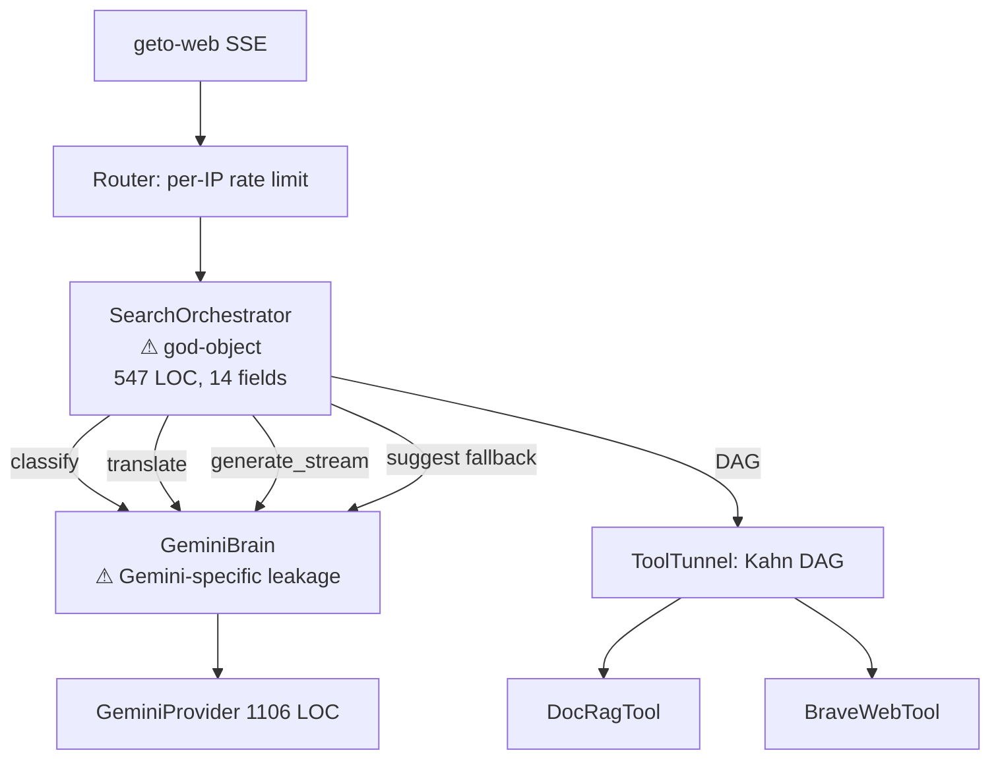
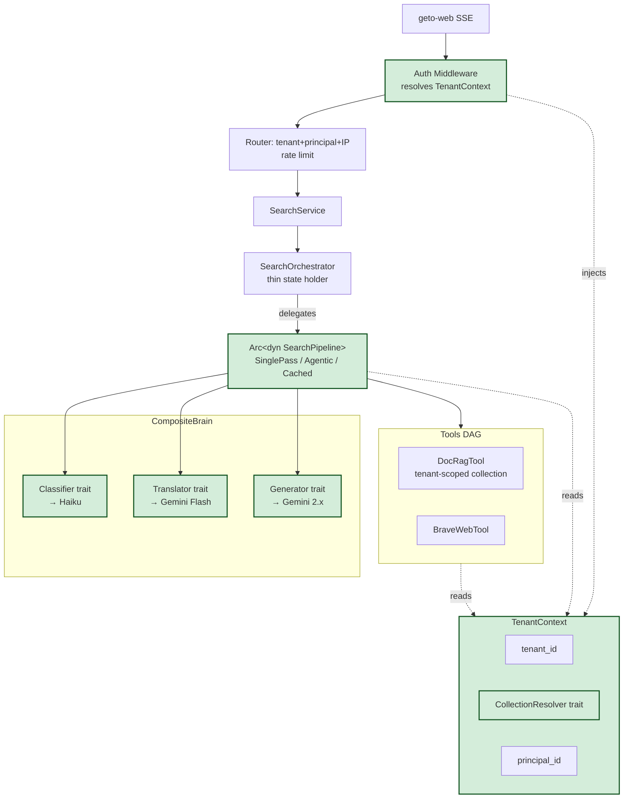
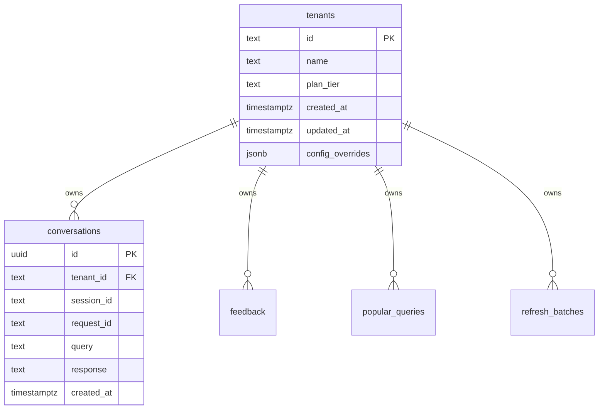
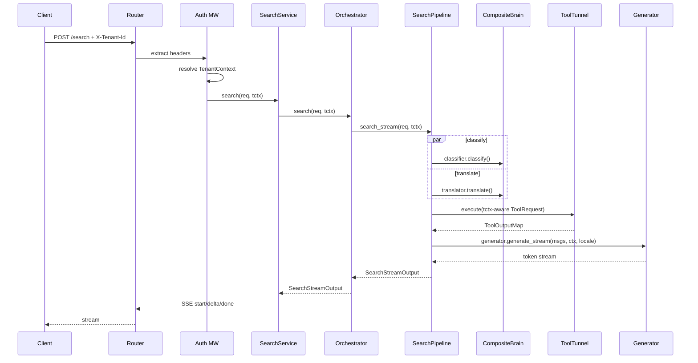

# Tech Spec: Kenjaku Flexibility Refactor — SearchPipeline + TenantContext + Brain Decomposition

> **IMPLEMENTED** — Phases 1, 2, 3a, 3b, 3c.1, 3c.2, 3d.1, 3d.2, 3e all merged to `main` as of 2026-04-16. See PRs #12–#20. This document is retained as the design record; post-implementation runtime details live in `docs/architect.md` §9.2 (Tenancy Architecture) and `CLAUDE.md` (Tenancy section).

| Items         | Details                                                                        |
| ------------- | ------------------------------------------------------------------------------ |
| Owner Team    | Kenjaku Core (MainApp Platform)                                                |
| Feature Label | `arch/flexibility-refactor`                                                    |
| Authors       | Sam Wang                                                                       |
| Audiences     | Engineering Leads, Platform, Security, SRE                                     |
| Status        | **Implemented** — merged 2026-04-16                                            |
| Version       | V1.0 as of 2026-04-14                                                          |
| Reviewers     | Architect, PM, Security                                                        |
| Useful links  | Architecture review (this repo), `docs/architecture/layered-refactor.md`       |
| Approved Date | 2026-04-16                                                                     |

> Follows the DDD (Domain Driven Design) template. Sections not applicable to this
> internal platform refactor are marked **N/A** and kept for traceability.

---

## TL;DR Change Summary

Break up the two god-objects in the search pipeline (`SearchOrchestrator` and
`GeminiBrain`/`GeminiProvider`) and thread a `TenantContext` through the request
path so the engine can (a) host multiple pipeline strategies (single-pass,
agentic, cached), (b) isolate data/rate-limits/corpora per tenant for the B2B
whitelabel roadmap, and (c) route each Brain sub-capability to the cheapest
model that serves it. Zero user-facing behavior change in Phase 1–2;
whitelabel capability unlocks in Phase 3.

**Grade today:** B+. **Grade after refactor:** A-.

---

## 1. Background

### 1.1 Objective

Kenjaku's RAG engine has clean crate-level boundaries but two hotspots are
drifting toward god-objects:

- `crates/kenjaku-service/src/harness/mod.rs` — `SearchOrchestrator` at 1,230 LOC
  (547 LOC prod) with 14 fields, owns orchestration + suggestion fallback +
  history + conversation + title resolution + locale memory.
- `crates/kenjaku-infra/src/llm/gemini.rs` — 1,106 LOC; `GeminiBrain` name and
  Gemini-specific `use_google_search_tool` flag leak into
  `ConversationAssembler::build` and `main.rs` wiring.

Simultaneously, the product roadmap (prediction/derivatives expansion, B2B
whitelabel, agentic tool-calling) requires three capabilities the current
architecture cannot cleanly absorb:

1. **Multiple pipeline strategies** (agentic loops, cost-tier routing, cached
   pipelines) — today's `search()` / `search_stream()` is a single function.
2. **Multi-tenancy** — no `tenant_id` exists in `SearchRequest`,
   `collection_name` is global, trending keys are locale-only, rate limits are
   per-IP only.
3. **Per-capability LLM routing** — `Brain` is one trait with 5 methods; you
   can't use Haiku for classification and Gemini for generation today without
   a wholesale swap.

### 1.2 Goals

- **G1.** Extract `SearchPipeline` strategy trait from `SearchOrchestrator`; the
  orchestrator becomes a thin state holder that delegates to an
  `Arc<dyn SearchPipeline>`.
- **G2.** Introduce `TenantContext` threaded through `SearchRequest`,
  `ToolRequest`, trending keys, rate-limiter key, and collection resolution.
- **G3.** Split `Brain` into `Classifier` + `Translator` + `Generator` traits,
  composed behind a `CompositeBrain`. Each sub-trait can point at a different
  provider.
- **G4.** No behavior change for existing single-tenant users in Phase 1–2.
  Phase 3 introduces tenant isolation behind a feature flag.
- **G5.** All changes land with zero clippy warnings, `cargo fmt` clean, and
  ≥80% test coverage on new code.

### 1.3 Non-Goals

- **NG1.** Rewriting `GeminiProvider` internals. We split it by concern
  (request builders, response parsing, streaming) but keep the wire protocol
  logic as-is.
- **NG2.** Implementing the agentic loop itself. We only unblock it by making
  `SearchPipeline` a swappable trait — a concrete `AgenticPipeline` is a
  follow-up spec.
- **NG3.** Multi-region deployment, DR, or Redis clustering. Those are
  tracked in a separate infra spec.
- **NG4.** Frontend changes. `geto-web` already sends `session_id`; tenant
  identity is injected server-side from auth headers in Phase 3 only.
- **NG5.** A full `Observability` overhaul. Metrics additions are deferred to
  Phase 4 (listed but specced separately).

---

## 2. Architecture Overview

### 2.1 Current Architecture (Before)



### 2.2 Target Architecture (After)



### 2.3 Service Relationship

| Service               | Relationship | Purpose                                                                                 |
| --------------------- | ------------ | --------------------------------------------------------------------------------------- |
| `kenjaku-core`        | Unchanged    | Adds `TenantContext`, `SearchPipeline`, `Classifier`/`Translator`/`Generator` traits    |
| `kenjaku-infra`       | Changed      | `GeminiProvider` split into `gemini/{request,response,stream}.rs`; new `CompositeBrain` |
| `kenjaku-service`     | Refactored   | `SearchOrchestrator` → thin; new `pipelines/{single_pass,cached}.rs`                    |
| `kenjaku-api`         | Changed      | Auth middleware emits `TenantContext` extractor; rate-limit key tuple change            |
| `kenjaku-server`      | Changed      | DI wires `CompositeBrain`, `CollectionResolver`, selected `SearchPipeline`              |
| PostgreSQL            | Schema add   | `tenants` table; `tenant_id` FK on `conversations`, `feedback`, `popular_queries`       |
| Redis                 | Key prefix   | `sl:`, `trending:`, `title:` gain `{tenant_id}:` prefix                                 |
| Qdrant                | Logical      | `collection_name` resolved per-tenant (e.g. `documents_{tenant_slug}`)                  |

---

## 3. Domain Design

### 3.1 Use Cases

| UC # | Actor               | Flow                                                                                                          |
| ---- | ------------------- | ------------------------------------------------------------------------------------------------------------- |
| UC-1 | Existing end user   | Sends query → resolves to default tenant (`public`) → SinglePassPipeline → unchanged behavior                 |
| UC-2 | B2B whitelabel user | Sends query with `X-Tenant-Id: acme` → auth resolves → tenant-scoped Qdrant collection + trending + rate limits |
| UC-3 | Platform ops        | Flips pipeline variant per-tenant via config (e.g. `acme` → `CachedPipeline` for sub-100ms SLA)              |
| UC-4 | Cost ops            | Swaps Classifier from Gemini Flash to Haiku via config — no code change                                      |
| UC-5 | Future: agentic     | New `AgenticPipeline` registered in DI; tenants opted in receive tool-calling mid-stream                      |

### 3.2 Fund Flow Diagrams

**N/A** — this is a platform refactor with no financial transactions.

### 3.3 Domain Models Design

#### 3.3.1 New core types (`crates/kenjaku-core/src/types/tenant.rs`)

```rust
/// Identifies a tenant for isolation of data, rate limits, and config.
/// `public` is the implicit default used for single-tenant and local dev.
#[derive(Debug, Clone, PartialEq, Eq, Hash, Serialize, Deserialize)]
pub struct TenantId(String);

impl TenantId {
    pub fn new(raw: impl Into<String>) -> Result<Self, ValidationError> { /* ... */ }
    pub fn public() -> Self { Self("public".into()) }
    pub fn as_str(&self) -> &str { &self.0 }
}

/// Principal (authenticated user/service) within a tenant.
#[derive(Debug, Clone, Serialize, Deserialize)]
pub struct PrincipalId(String);

/// Per-request tenant and principal context. Threaded through
/// SearchRequest, ToolRequest, trending keys, collection resolver.
#[derive(Debug, Clone)]
pub struct TenantContext {
    pub tenant_id: TenantId,
    pub principal_id: Option<PrincipalId>,
    pub plan_tier: PlanTier, // free / pro / enterprise
}

#[derive(Debug, Clone, Copy, PartialEq, Eq, Serialize, Deserialize)]
#[serde(rename_all = "snake_case")]
pub enum PlanTier { Free, Pro, Enterprise }
```

#### 3.3.2 New pipeline trait (`crates/kenjaku-core/src/traits/pipeline.rs`)

```rust
#[async_trait]
pub trait SearchPipeline: Send + Sync {
    async fn search(&self, req: &SearchRequest, tctx: &TenantContext)
        -> Result<SearchResponse>;

    async fn search_stream(&self, req: &SearchRequest, tctx: &TenantContext)
        -> Result<SearchStreamOutput>;

    fn name(&self) -> &'static str;
}
```

#### 3.3.3 Brain decomposition (`crates/kenjaku-core/src/traits/brain.rs`)

```rust
#[async_trait]
pub trait Classifier: Send + Sync {
    async fn classify(&self, query: &str) -> Result<Intent>;
}

#[async_trait]
pub trait Translator: Send + Sync {
    async fn translate(&self, query: &str) -> Result<TranslationResult>;
}

#[async_trait]
pub trait Generator: Send + Sync {
    async fn generate(&self, messages: &[Message], ctx: &ToolContext, loc: Locale)
        -> Result<String>;
    async fn generate_stream(&self, messages: &[Message], ctx: &ToolContext, loc: Locale)
        -> Result<Pin<Box<dyn Stream<Item = Result<StreamChunk>> + Send>>>;
    async fn suggest(&self, chunks: &[DocChunk], count: usize) -> Result<Vec<String>>;
}

/// Composes three sub-capabilities. Each may point at a different provider.
pub struct CompositeBrain {
    pub classifier: Arc<dyn Classifier>,
    pub translator: Arc<dyn Translator>,
    pub generator: Arc<dyn Generator>,
}

// Impl Brain for CompositeBrain — preserves existing call sites during rollout.
```

#### 3.3.4 Collection resolution (`crates/kenjaku-core/src/traits/collection.rs`)

```rust
#[async_trait]
pub trait CollectionResolver: Send + Sync {
    async fn resolve(&self, tenant: &TenantId) -> Result<String>;
}

/// Default impl: `{base_name}_{tenant_slug}`, with `public` mapping to base.
pub struct PrefixCollectionResolver { pub base_name: String }
```

### 3.4 State Machines Design

**N/A** — no stateful workflows added. Pipeline selection is stateless per
request (read from config + tenant plan tier).

### 3.5 Configuration Design

| Setting/Flag                             | Type         | Default        | Description                                                  |
| ---------------------------------------- | ------------ | -------------- | ------------------------------------------------------------ |
| `tenancy.enabled`                        | boolean      | `false`        | Gates Phase 3. When `false`, all requests resolve to `public`. |
| `tenancy.default_tenant`                 | string       | `public`       | Tenant used when auth doesn't provide one                    |
| `tenancy.header_name`                    | string       | `X-Tenant-Id`  | Header name parsed by auth middleware                        |
| `tenancy.collection_name_template`       | string       | `{base}_{tenant}` | Template for Qdrant collection resolution                 |
| `pipeline.default_variant`               | enum         | `single_pass`  | `single_pass` / `cached` / `agentic` (future)                |
| `pipeline.per_tenant.<id>.variant`       | enum         | inherits       | Override pipeline variant for a specific tenant              |
| `brain.classifier.provider`              | string       | `gemini`       | `gemini` / `anthropic` / `openai`                            |
| `brain.classifier.model`                 | string       | `gemini-3.1-flash-lite-preview` | Model for intent classification              |
| `brain.translator.provider`              | string       | `gemini`       | Translator provider                                          |
| `brain.generator.provider`               | string       | `gemini`       | Main answer generation provider                              |
| `rate_limit.key_strategy`                | enum         | `ip`           | `ip` / `tenant_ip` / `tenant_principal_ip`                   |

All values live under `config/base.yaml` and `config/{env}.yaml`. No serde
defaults for new required fields — fail fast at `AppConfig::validate_secrets`
(convention established in the prior Rust review refactor).

---

## 4. Data Design

### 4.1 DB Schemas Design



New migration `migrations/20260414000001_add_tenant_id.sql`:

```sql
CREATE TABLE tenants (
    id           TEXT PRIMARY KEY,
    name         TEXT NOT NULL,
    plan_tier    TEXT NOT NULL CHECK (plan_tier IN ('free','pro','enterprise')),
    created_at   TIMESTAMPTZ NOT NULL DEFAULT NOW(),
    updated_at   TIMESTAMPTZ NOT NULL DEFAULT NOW(),
    config_overrides JSONB NOT NULL DEFAULT '{}'::jsonb
);

INSERT INTO tenants (id, name, plan_tier) VALUES ('public', 'Public', 'enterprise');

ALTER TABLE conversations
    ADD COLUMN tenant_id TEXT NOT NULL DEFAULT 'public'
        REFERENCES tenants(id) ON DELETE RESTRICT;
CREATE INDEX idx_conversations_tenant_created ON conversations(tenant_id, created_at DESC);

ALTER TABLE feedback
    ADD COLUMN tenant_id TEXT NOT NULL DEFAULT 'public'
        REFERENCES tenants(id) ON DELETE RESTRICT;

ALTER TABLE popular_queries
    ADD COLUMN tenant_id TEXT NOT NULL DEFAULT 'public'
        REFERENCES tenants(id) ON DELETE RESTRICT;
-- Drop+recreate unique index to include tenant_id
DROP INDEX IF EXISTS uniq_popular_query_locale;
CREATE UNIQUE INDEX uniq_popular_query_tenant_locale
    ON popular_queries(tenant_id, locale, normalized_query);

ALTER TABLE refresh_batches
    ADD COLUMN tenant_id TEXT NOT NULL DEFAULT 'public'
        REFERENCES tenants(id) ON DELETE RESTRICT;
```

### 4.2 Database Design

- `tenants` is the source of truth for tenant identity, plan tier, and JSON
  config overrides (e.g. custom prompt fragments, feature opt-ins).
- All existing tables gain `tenant_id TEXT NOT NULL DEFAULT 'public'` —
  backwards compatible because pre-migration rows belong to the implicit
  public tenant.
- Composite indexes lead with `tenant_id` to ensure per-tenant queries stay
  selective as data grows.

### 4.3 Storage Design

Redis keys gain a `{tenant_id}:` prefix:

| Old key pattern                | New key pattern                             |
| ------------------------------ | ------------------------------------------- |
| `sl:{session_id}`              | `sl:{tenant_id}:{session_id}`               |
| `trending:daily:{locale}:...`  | `trending:{tenant_id}:daily:{locale}:...`   |
| `trending:weekly:{locale}:...` | `trending:{tenant_id}:weekly:{locale}:...`  |
| `title:{url_hash}`             | unchanged (tenant-agnostic, shared cache)   |

Qdrant collection name resolved by `CollectionResolver::resolve(&tenant_id)`:

- `public` → `documents` (backwards compatible)
- `acme` → `documents_acme`

### 4.4 Data Privacy Design

- `tenant_id` is not PII but is treated as customer-identifying metadata. Never
  log full tenant config overrides — only `tenant_id` and plan tier.
- Per-tenant Redis/PG separation supports GDPR right-to-erasure:
  `DELETE FROM conversations WHERE tenant_id = $1` + `SCAN MATCH *:{tid}:*`.
- Cross-tenant reads are blocked at the query layer (every repo method adds
  `WHERE tenant_id = $1` — enforced by code review and new integration tests).

### 4.5 Data Retention / Housekeeping Strategy

Unchanged existing retention policies apply per-tenant. New ops runbook entry:
when a tenant off-boards, run the full purge procedure (SQL + Redis SCAN +
Qdrant collection drop).

---

## 5. APIs Design

### 5.1 Model Definition

No user-facing DTO changes in Phase 1–2. Phase 3 adds optional
`X-Tenant-Id` header resolution — clients that don't send it resolve to
`public` (backwards compatible).

### 5.2 User APIs - Schema

`POST /api/v1/search` — no body change. New header:

| Header          | Required | Description                                                    |
| --------------- | -------- | -------------------------------------------------------------- |
| `X-Session-Id`  | No       | Existing — session identity                                    |
| `X-Request-Id`  | No       | Existing — request tracing                                     |
| `X-Tenant-Id`   | No       | **New** — tenant scoping. Defaults to `public` when absent.    |
| `Authorization` | Phase 3  | JWT carrying `tenant_id` + `principal_id` claims (overrides header) |

#### 5.2.1 Sequence Diagrams



#### 5.2.2 Idempotent Mechanism

Unchanged. `X-Request-Id` continues to be the idempotency key for feedback
writes; search responses are not idempotent by design (stochastic).

#### 5.2.3 Rate Limit Mechanism

Phase 3: `tower_governor` `KeyExtractor` switches from `SmartIpKeyExtractor` to a
composite `TenantPrincipalIpExtractor`. Per-tenant limits resolved from
`tenants.config_overrides.rate_limit`. Default: 60 req/min for `free`, 240
for `pro`, unlimited for `enterprise`.

#### 5.2.4 Cache Mechanism

No new caching in this spec. A `CachedPipeline` variant is specced as a
trait-level extension point; implementation is a follow-up.

#### 5.2.5 Error Responses

| Error Code      | Message                              | Description                                         |
| --------------- | ------------------------------------ | --------------------------------------------------- |
| `KNJK-4010`     | `Unauthorized tenant`                | `X-Tenant-Id` provided but auth token missing/mismatch |
| `KNJK-4031`     | `Tenant not found`                   | Tenant header refers to unknown tenant              |
| `KNJK-4032`     | `Tenant suspended`                   | Tenant exists but plan_tier check fails             |
| `KNJK-4291`     | `Tenant rate limit exceeded`         | Per-tenant limit hit (distinct from per-IP)         |
| `KNJK-5031`     | `Pipeline unavailable`               | Configured pipeline variant not registered          |

All errors flow through `Error::user_message()` per existing convention — no
DB/API internals leaked.

#### 5.2.6 Timeout Mechanism

Unchanged — existing `request_timeout_secs: 30` plus per-tool budgets.

#### 5.2.7 Retry Mechanism

Unchanged — upstream retry responsibility remains on the client.

### 5.3 Internal APIs - Schema

**N/A** — no internal APIs added.

### 5.4 Partner APIs - Schema

**N/A** — whitelabel partner API surface is out of scope (separate spec).

---

## 6. Logging Design

- Every log line gains `tenant_id` and (when present) `principal_id` fields via
  `tracing` span attributes. Example span in `SearchOrchestrator`:

```rust
#[instrument(skip_all, fields(
    tenant_id = %tctx.tenant_id.as_str(),
    principal_id = tctx.principal_id.as_ref().map(|p| p.as_str()),
    request_id = %req.request_id,
    session_id = %req.session_id,
    pipeline = self.pipeline.name(),
))]
```

- Tenant config overrides are **never** logged. Only `tenant_id` + `plan_tier`.
- PII in queries continues to follow existing policy (queries are treated as
  user content, logged at `debug!` level only when
  `telemetry.log_level=debug`).

> ⚠️ Data privacy consideration: adding `tenant_id` to logs is a schema change
> for log-consuming dashboards. Notify the observability team before rollout.

---

## 7. Security Design

- **Authentication/Authorization**: Phase 3 wires a minimal JWT validator in
  an `auth` middleware crate. The validator resolves `tenant_id` and
  `principal_id` from signed claims. `X-Tenant-Id` header is accepted only when
  `tenancy.enabled=false` (dev/local). **Production requires JWT.**
- **Tenant Isolation**: every repo method adds `WHERE tenant_id = $1`. An
  integration test (`tests/tenant_isolation.rs`) seeds two tenants and asserts
  cross-tenant reads return zero rows. A semgrep rule flags raw `sqlx::query!`
  blocks without `tenant_id` bindings in repo files.
- **XSS Prevention**: unchanged — frontend `geto-web` already uses
  `DOMPurify`-style sanitization via the Markdown renderer.
- **CSRF Protection**: unchanged — API is pure JSON/SSE with JWT bearer auth,
  no cookies.
- **CORS Configuration**: unchanged (same-origin nginx reverse-proxy).
- **SQL Injection Prevention**: all queries are parameterized via `sqlx`
  macros. New tenant-scoped queries continue this pattern.
- **Key Management**: per-tenant secrets (e.g. BYO API keys) are a follow-up.
  Phase 1–3 use shared platform keys from `KENJAKU__*` env vars.
- **Rate Limit as DoS Guard**: tenant-level limits prevent a noisy tenant from
  exhausting the platform.

Applicable checklist:

- [x] Authentication/Authorization — JWT validator (Phase 3)
- [x] XSS Prevention — unchanged, frontend-side
- [x] CSRF Protection — N/A, JWT bearer only
- [x] CORS Configuration — unchanged
- [x] SQL Injection Prevention — parameterized `sqlx`
- [x] Key Management — shared platform keys (per-tenant keys deferred)

---

## 8. Compatibility Design

**Strict backwards compatibility** through Phase 1–2:

- Existing single-tenant deployments default to `tenancy.enabled=false` and
  `tenant_id=public` — zero behavior change.
- DB migration adds `tenant_id` with `DEFAULT 'public'` so existing rows are
  valid.
- Redis keys migrate transparently: new writes use the prefixed form; old
  unprefixed keys age out via existing TTLs (max 14 days for trending
  weekly). No bulk migration required.
- `Brain` trait remains; `CompositeBrain` implements it — existing call sites
  keep compiling. Individual sub-traits are additive.

**Breaking change** in Phase 3 (gated by `tenancy.enabled=true`):

- `X-Tenant-Id` header without a matching JWT becomes a 401.
- Per-tenant rate limits apply.
- Cross-tenant data reads fail with 404.

Platform support unchanged (same Rust MSRV 1.88, same edition 2024, same
Docker base image).

---

## 9. Operations

### 9.1 Capacity Planning

- **DB**: `tenants` table is tiny (<10K rows expected). Composite indexes add
  ~15-20% to write cost on `conversations`/`feedback`/`popular_queries` — well
  within margin.
- **Postgres pool**: bump `postgres.max_connections` from `10` to `25` to
  accommodate per-tenant isolation patterns and give headroom at 10× traffic.
- **Redis**: key prefix adds ~12 bytes per key. At current ~10K active trending
  keys that is ~120KB overhead — negligible.
- **Qdrant**: one collection per active B2B tenant. Shared public collection
  for default traffic. Collection count budget: plan for 20-50 tenants in year 1.

### 9.2 Rollout Plan ⚠️ REQUIRED

| Phase | Scope                                             | Gate                                | Duration |
| ----- | ------------------------------------------------- | ----------------------------------- | -------- |
| **Phase 1** | `SearchPipeline` extraction + CompositeBrain refactor | `tenancy.enabled=false`; internal only. Shadow traffic on staging. | 1 week |
| **Phase 2** | Brain sub-trait split; swap Classifier → Haiku behind feature flag. Measure cost + latency. | Cost drop validated (target ≥40%); latency unchanged. | 1 week |
| **Phase 3** | Tenant data model + migration + auth middleware. Enable `tenancy.enabled=true` on staging with a fake `acme` tenant. | All integration tests pass. Security sign-off. | 2 weeks |
| **Phase 4** | Production rollout: single first-party tenant (`public`) runs under tenancy-enabled code. Add `metrics` crate + Prometheus. | 1 week of clean metrics, no regression alerts. | 2 weeks |
| **Phase 5** | Onboard first real B2B tenant. Manual DB seed + Qdrant collection create. | Tenant ack. | Ongoing |

Rollback: every phase can be reverted by flipping the relevant config flag —
no DB rollback needed (schema changes are additive).

### 9.3 Monitoring Metrics and Alerts ⚠️ REQUIRED

| Metric                                    | Threshold                  | Alert                              |
| ----------------------------------------- | -------------------------- | ---------------------------------- |
| `search_request_total{tenant,pipeline}`   | —                          | Dashboard only                     |
| `search_latency_seconds{tenant,pipeline}` | p95 > 3s sustained 5 min   | Page oncall                        |
| `tool_error_total{tool,tenant,reason}`    | rate > 5/min per tool      | Warn in #kenjaku-alerts            |
| `cancel_total{reason}`                    | rate doubles baseline      | Warn                               |
| `llm_cost_usd_total{provider,tier}`       | daily budget > $X          | Page billing oncall                |
| `brain_subcapability_latency{type}`       | classifier p95 > 1s        | Warn (regression signal)           |
| `cross_tenant_read_denied_total`          | > 0                        | **PAGE SECURITY** (invariant breach) |
| `pipeline_unavailable_total{variant}`     | > 0                        | Page oncall                        |
| `redis_down_seconds`                      | > 60                       | Page oncall                        |
| `pg_pool_saturation_ratio`                | > 0.8 sustained 5 min      | Warn                               |

Metric ingestion: `metrics` crate + Prometheus exporter on port `:9090/metrics`.
Dashboards in Grafana. Phase 4 scope.

### 9.4 Fallback Plan ⚠️ REQUIRED

| Scenario                          | Fallback                                                                    |
| --------------------------------- | --------------------------------------------------------------------------- |
| `SearchPipeline` variant missing  | Orchestrator logs `pipeline_unavailable_total`, returns `KNJK-5031`         |
| Auth middleware misconfigured     | Flip `tenancy.enabled=false` via env var + rolling restart (~30s)           |
| Per-tenant Qdrant collection down | `CollectionResolver` falls back to shared `documents` collection + warns   |
| Classifier (Haiku) degraded       | Feature flag swap back to Gemini Classifier — config-only, no deploy        |
| Migration failure                 | Schema is additive; reverse `ALTER TABLE … DROP COLUMN tenant_id` possible  |
| Tenant-scoped Redis keys lost     | Fire-and-forget pipelines continue; trending data re-accumulates            |
| Cross-tenant data leak (SEV-1)    | Immediate kill switch: `tenancy.enabled=false` + tenant suspension + forensic |

### 9.5 Security Assessment ⚠️ REQUIRED

- [ ] Threat modeling completed — STRIDE pass on multi-tenant data isolation,
      JWT validation, and rate-limit bypass. Owner: security-reviewer agent.
- [ ] Penetration testing — required before Phase 5 (first B2B tenant). Scope:
      cross-tenant data reads, JWT forgery, rate-limit bypass via header
      manipulation.
- [ ] Security team sign-off — blocking for Phase 3 merge.
- [ ] Secrets audit — confirm no per-tenant key leakage in logs, metrics, or
      error responses.
- [ ] Compliance review — crypto.com regulated-platform requirements: data
      residency per-tenant, right-to-erasure tested end-to-end.

### 9.6 Test Plan

- **Unit tests**: each new trait (`SearchPipeline`, `Classifier`, `Translator`,
  `Generator`, `CollectionResolver`) ships with mock implementations and ≥3
  behavioral tests. Target ≥80% coverage on new code.
- **Integration tests** (`tests/` in `kenjaku-service`):
  - `tenant_isolation.rs` — seed tenants A and B, assert no cross-reads across
    conversations, feedback, popular_queries, Redis trending, Qdrant
    collections.
  - `pipeline_swap.rs` — register two pipelines, assert config selects the
    correct variant per request.
  - `composite_brain.rs` — compose Haiku-classifier + Gemini-generator,
    assert end-to-end search succeeds.
- **E2E tests** (`docs/architecture/layered-refactor.md` conventions):
  existing search e2e retained; add one new scenario with `X-Tenant-Id: acme`.
- **Load tests**: k6 or Locust harness hitting 2× current baseline traffic
  with a mix of 3 tenants; assert p95 latency holds and per-tenant rate
  limits fire correctly.
- **Snapshot tests**: `brain/prompt.rs` prompt assembly (covers regression
  risk in Brain split).

### 9.7 Infrastructure Plan

- Docker Compose: no new services. `kenjaku` gains the `metrics` exporter
  port exposed (Phase 4).
- Production: wire Prometheus scrape + Grafana dashboards. Register
  PagerDuty targets for the SEV-1 metric (`cross_tenant_read_denied_total`).
- Secrets: continue using `config/secrets.{env}.yaml` (gitignored) + env vars.
  Per-tenant secrets deferred.

---

## Appendix

### A. Phase-by-Phase Cost Estimate

| Phase | Effort (T-shirt) | Risk  | Preconditions                              |
| ----- | ---------------- | ----- | ------------------------------------------ |
| 1     | S (3-5 days)     | Low   | none                                       |
| 2     | S (3-5 days)     | Low   | Phase 1 merged                             |
| 3     | L (2 weeks)      | Med   | Security review scheduled, migration plan approved |
| 4     | M (1 week)       | Low   | Phase 3 stable 1 week                      |
| 5     | Ongoing          | Med   | Real B2B signed contract                   |

### B. Deferred / Follow-Up Specs

1. **Typed `ToolOutput::Structured`** — replace `serde_json::Value` with
   `Box<dyn StructuredFact>`. Cost: M. Unlocks SQL tool, price-quote tool.
2. **`AgenticPipeline` implementation** — requires Phase 1 done. Cost: L.
3. **Per-tenant BYO API keys** — tenant-scoped secret resolution. Cost: M.
4. **Redis clustering + multi-region** — separate infra spec.
5. **Per-tenant custom prompts** — via `tenants.config_overrides.prompts`. Cost: S.

### C. File-Level Change Inventory

| File                                                               | Change        |
| ------------------------------------------------------------------ | ------------- |
| `crates/kenjaku-core/src/types/tenant.rs`                          | New           |
| `crates/kenjaku-core/src/traits/pipeline.rs`                       | New           |
| `crates/kenjaku-core/src/traits/collection.rs`                     | New           |
| `crates/kenjaku-core/src/traits/brain.rs`                          | Split to sub-traits + `CompositeBrain` |
| `crates/kenjaku-service/src/pipelines/mod.rs`                      | New           |
| `crates/kenjaku-service/src/pipelines/single_pass.rs`              | New (extracted from `harness/mod.rs`) |
| `crates/kenjaku-service/src/harness/mod.rs`                        | Slim down to state holder |
| `crates/kenjaku-infra/src/llm/gemini/{request,response,stream}.rs` | Split from `gemini.rs` |
| `crates/kenjaku-infra/src/brain/composite.rs`                      | New           |
| `crates/kenjaku-api/src/middleware/auth.rs`                        | New (Phase 3) |
| `crates/kenjaku-api/src/extractors/tenant.rs`                      | New (Phase 3) |
| `crates/kenjaku-server/src/main.rs`                                | DI wiring for pipelines + composite brain + collection resolver |
| `migrations/20260414000001_add_tenant_id.sql`                      | New           |
| `config/base.yaml`                                                 | Add tenancy + pipeline + brain sub-config sections |

### References

- Architecture Review (this session, 2026-04-14)
- `docs/architecture/layered-refactor.md` — prior 5-layer refactor
- `crates/kenjaku-service/src/harness/mod.rs` — god-object hotspot
- `crates/kenjaku-infra/src/llm/gemini.rs` — provider hotspot
- `crates/kenjaku-core/src/traits/brain.rs` — trait split candidate
- [Boring Rust principles](~/.claude/skills/effective-rust/SKILL.md)
