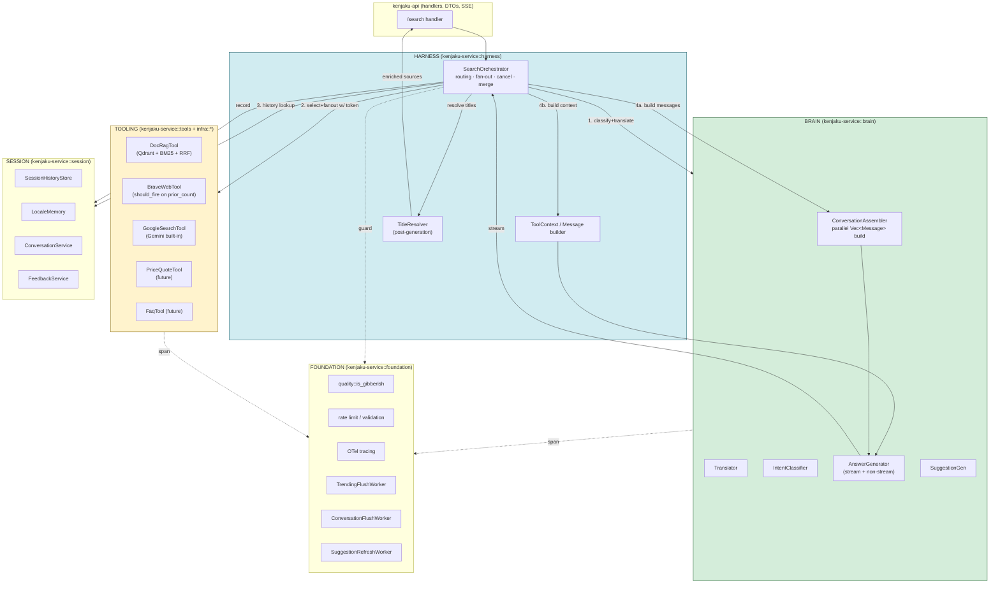
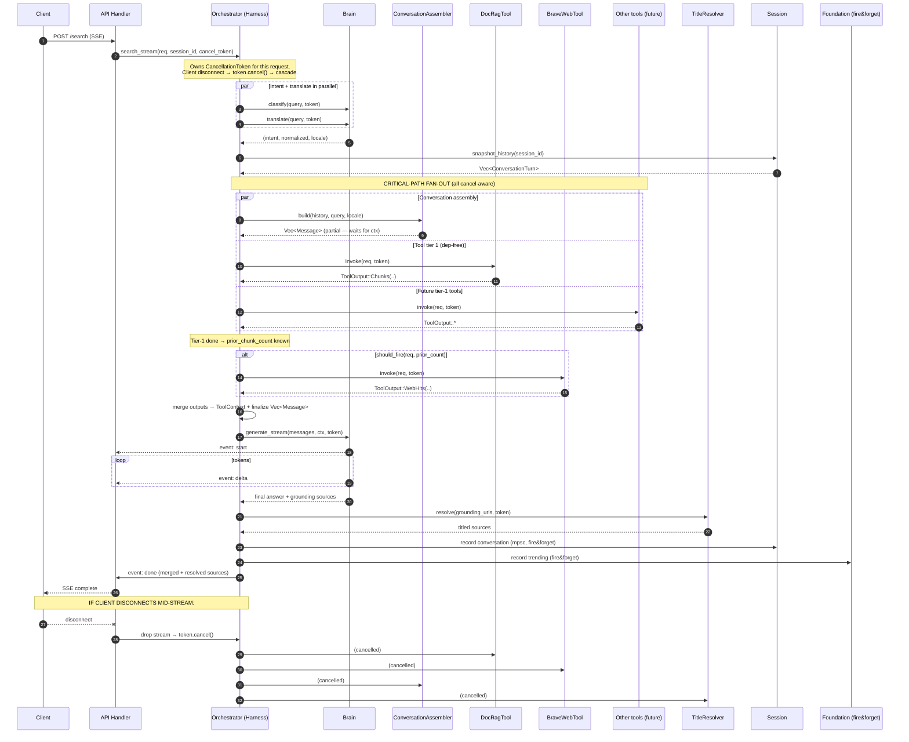

# Kenjaku Layered Architecture Refactor — Design

**Status:** proposal v2 — amended after independent critique
**Author:** architect agent (v1), code-reviewer critique integrated, decisions by Sam
**Branch:** `refactor/layered-architecture`
**Builds on:** commit `cab2292` (google_search gating) — generalizes that conditional into a plugin layer.

## Changelog

- **v2 (this revision)** — integrates findings from the second-opinion critique:
  - Added `collection_name` to `ToolRequest` (§4). Decision: field on request, not constructor-captured, so the Harness stays collection-aware.
  - Introduced a core `Message` abstraction (§5) and a parallel `ConversationAssembler` that runs on the critical path alongside tool fan-out. This makes the Brain trait LLM-agnostic and unlocks future multi-LLM support without touching core types.
  - Threaded `CancellationToken` through `Tool::invoke` and the Harness fan-out (§4, §7) so SSE-client disconnects cancel all in-flight tool calls and content-addon assembly, not just the LLM stream.
  - Redrew the sequence diagram (§2) to show `DocRagTool` firing before `BraveWebTool` — Brave's `should_fire(prior_chunk_count)` dependency means they cannot be parallel. Future dependency-free tools still fan out in parallel.
  - Assigned `TitleResolver` explicitly to the Harness as a post-generation step (§1, §3).
  - Replaced `join_all<Result>` short-circuit behavior with per-tool error collection → `ToolOutput::Empty` degradation, matching the stated error policy (§4.3, §7).
  - Promoted the Phase 1 byte-equivalence unit test from criterion to **hard gate** (§6).
  - Added §7.1 (feature flagging / rollout) and §7.2 (test-mocking strategy) sections.
  - Added `Cancelled` variant to `ToolError`.

## Exec Summary

Today `SearchService::search` is a 200-line procedure that owns intent classification, translation, retrieval, web fallback, LLM generation, suggestions, trending, and conversation persistence. It treats the Gemini provider, the Brave provider, and `HybridRetriever` as three bespoke side-channels. Adding a price-quote tool today requires edits in `SearchService`, `AppState`, the config loader, and a new trait. This is the 3-4-places edit pain the refactor eliminates.

The refactor reshapes the same six crates around five explicit layers — **Brain, Session, Foundation, Tooling, Harness** — without adding crates or moving files wholesale. Three load-bearing decisions:

1. **A single `Tool` trait in `kenjaku-core`**, owning the contract `(ToolRequest, CancellationToken) -> ToolOutput`. `HybridRetriever`, `BraveSearchProvider`, and every future plugin implement it.
2. **A core `Message` abstraction** that the Brain facade assembles in parallel with tool fan-out. LLM providers implement `messages_to_wire(&[Message]) -> Self::Wire` internally, so multi-turn conversation assembly never leaks infra types into service layer.
3. **The Harness owns the critical-path fan-out and cancellation lifecycle.** `SearchOrchestrator` replaces the body of `SearchService::search`, fans out tools with `futures::future::join_all` on `Result`s (never `try_join_all`, per §4.3 error policy), and propagates a `CancellationToken` so SSE-client disconnects cascade through every tool and assembler.

This is phased, not big-bang. **Phase 1 ships in one PR**, ~500 LOC, behind a hard gate: a unit test asserting byte-equivalence between `DocRagTool::invoke` and the live `HybridRetriever::retrieve` output. Subsequent phases peel responsibilities off `SearchService` one at a time, each phase revert-safe and green.

---

## 1. Layer Diagram



## 2. Sequence: `/search` streaming flow

Two things the v1 diagram got wrong, both fixed here:

1. **`BraveWebTool` is NOT parallel with `DocRagTool`** — its `should_fire` depends on `prior_chunk_count`, so DocRag must complete before Brave can decide whether to fire.
2. **`ConversationAssembler` runs in parallel with the tool fan-out**, not serially, because it only needs `(history, query_raw, locale)` — none of which depend on tool outputs.



## 3. Crate / module topology

**Decision: no new crates. Layers become module trees inside existing crates.** Adding crates would force trait moves that break the `core ← infra ← service` DAG. Long-term maintainability outranks cosmetic purity today. **Revisit at Phase 5** — if `kenjaku-service` has crossed ~5000 LOC, split `tools/` and `brain/` into their own crates before adding a sixth tool.

```
kenjaku-core/src/
├── traits/
│   ├── tool.rs          [NEW]   ← the Tool trait (the crown jewel)
│   ├── brain.rs         [NEW]   ← Brain trait over the core Message type
│   ├── llm.rs                    (kept — low-level wire contract, impls accept &[Message])
│   ├── retriever.rs              (deprecated in Phase 4; DocRagTool replaces callers)
│   └── web_search.rs             (deprecated in Phase 4; BraveWebTool replaces callers)
└── types/
    ├── tool.rs          [NEW]   ← ToolId, ToolRequest, ToolOutput, ToolError, ToolConfig
    └── message.rs       [NEW]   ← Message, Role, ContentPart — the LLM-agnostic wire

kenjaku-infra/src/          (unchanged structure — still the I/O layer)
├── llm/gemini.rs                  (loses build_search_prompt, system_instruction_text,
│                                    use_google_search_tool; gains messages_to_wire)
├── web_search/brave.rs            (keeps WebSearchProvider impl through Phase 3)
├── title_resolver.rs              (kept — accessed through a trait in Phase 2)
└── qdrant/                        (unchanged)

kenjaku-service/src/
├── brain/               [NEW]   ← Brain facade + ConversationAssembler
│   ├── mod.rs                    (Brain trait impl)
│   ├── assembler.rs     [NEW]   ← ConversationAssembler: history → Vec<Message>, cancel-aware
│   ├── translator.rs             (moved from translation.rs)
│   ├── classifier.rs             (moved from intent.rs)
│   ├── prompt.rs        [NEW]   ← prompt TEXT builders (system instruction, user turn)
│   └── generator.rs              (wraps LlmProvider::generate + generate_stream over &[Message])
├── tools/               [NEW]   ← Tool implementations
│   ├── mod.rs                    (re-exports + ToolRegistry)
│   ├── config.rs        [NEW]   ← ToolConfig defaults + rollout policy
│   ├── doc_rag.rs                (wraps HybridRetriever, impl Tool)
│   ├── brave_web.rs              (wraps BraveSearchProvider, impl Tool)
│   ├── gemini_grounding.rs       (built-in google_search shim, impl Tool)
│   ├── price_quote.rs   [future]
│   └── faq.rs           [future]
├── session/             [NEW]   ← conversation.rs + history.rs + locale_memory.rs + feedback.rs
├── foundation/          [NEW]   ← quality.rs + *_worker.rs move here (workers already exist)
├── harness/             [NEW]
│   ├── mod.rs                    (SearchOrchestrator — the new SearchService)
│   ├── routing.rs                (select_tools: intent → Vec<ToolId>, rollout gating)
│   ├── fanout.rs        [NEW]   ← join_all<Result> → ToolOutput::Empty error mapper
│   ├── context.rs                (ToolOutput → ToolContext merger)
│   └── title_resolver.rs [NEW]  ← wraps the infra TitleResolver behind a service-layer trait
└── lib.rs                        (re-exports preserved for api crate compat)
```

Nothing in `kenjaku-api`, `kenjaku-server`, or `kenjaku-ingest` moves. `SearchService` keeps its public name as a re-export of `harness::SearchOrchestrator` for one release so handler code doesn't churn.

## 4. The `Tool` trait (the crown jewel)

```rust
// kenjaku-core/src/types/tool.rs

use serde::{Deserialize, Serialize};
use crate::types::intent::Intent;
use crate::types::locale::Locale;
use crate::types::search::{LlmSource, RetrievedChunk};

/// Stable identifier for a tool. String-typed so config files and logs
/// stay readable; the registry enforces uniqueness at boot.
#[derive(Debug, Clone, PartialEq, Eq, Hash, Serialize, Deserialize)]
pub struct ToolId(pub String);

/// What the Harness hands a tool on invocation. Owned (not borrowed)
/// so tools can spawn work onto other tasks without lifetime gymnastics.
/// Cloning is cheap — a handful of small strings per request.
#[derive(Debug, Clone)]
pub struct ToolRequest {
    pub query_raw: String,           // user's original text
    pub query_normalized: String,    // translator output (canonical English)
    pub locale: Locale,
    pub intent: Intent,
    pub collection_name: String,     // Qdrant collection; multi-collection-ready
    pub top_k: usize,
    pub request_id: String,
    pub session_id: String,
}

/// What a tool returns. Tagged enum (not `Vec<RetrievedChunk>`) so
/// non-document tools don't have to shoehorn their payload into chunk
/// shape. The Harness normalizes per-variant via `context::merge`.
#[derive(Debug, Clone)]
pub enum ToolOutput {
    /// Document RAG and FAQ retrieval — already chunk-shaped.
    /// `RetrievedChunk.retrieval_method` carries provenance
    /// (`Dense`/`Sparse`/`Web`); the Harness uses it for dedup and
    /// `[Source N]` ordering.
    Chunks {
        chunks: Vec<RetrievedChunk>,
        provider: String,
    },
    /// Live web search hits. Harness converts to synthetic chunks
    /// with `RetrievalMethod::Web`, preserving today's `[Source N]`
    /// prompt wording.
    WebHits {
        hits: Vec<LlmSource>,
        provider: String,
    },
    /// Structured payload (price quotes, FX, account lookups, etc.).
    /// Harness renders into a Brain-consumable fact block via the
    /// tool's `render_fact()` hook.
    Structured {
        facts: serde_json::Value,
        provider: String,
    },
    /// Tool ran but had nothing to contribute, OR was degraded from
    /// an error by the Harness fanout wrapper. Cheaper than Err —
    /// the Harness won't log a warning or fail the request.
    Empty,
}

/// Per-tool error. Distinct from `kenjaku_core::Error` so the Harness
/// decides whether to degrade (→ Empty) or propagate (→ user-facing).
#[derive(Debug, thiserror::Error)]
pub enum ToolError {
    #[error("tool disabled by config or rollout")] Disabled,
    #[error("tool timeout ({0}ms)")]                Timeout(u64),
    #[error("upstream: {0}")]                       Upstream(String),
    #[error("bad request: {0}")]                    BadRequest(String),
    #[error("cancelled")]                           Cancelled,
}

/// Default config for a tool. Each tool defines its own extension
/// struct (e.g. `BraveToolConfig { base: ToolConfig, api_key, ... }`)
/// so rollout policy stays uniform while tool-specific knobs live
/// next to the impl.
#[derive(Debug, Clone, Serialize, Deserialize)]
pub struct ToolConfig {
    #[serde(default = "default_true")]
    pub enabled: bool,
    /// Percentage rollout, 0.0–1.0. `None` means unconditional
    /// (enabled=true → always fires, enabled=false → never). With
    /// `Some(p)`, hash(request_id) < p decides per-request.
    #[serde(default)]
    pub rollout_pct: Option<f32>,
}

fn default_true() -> bool { true }
```

```rust
// kenjaku-core/src/traits/tool.rs

use async_trait::async_trait;
use tokio_util::sync::CancellationToken;
use crate::types::tool::{ToolId, ToolRequest, ToolOutput, ToolError, ToolConfig};

/// A pluggable external tool. Implementations live in
/// `kenjaku-service::tools/` (wrapping infra clients and domain logic).
#[async_trait]
pub trait Tool: Send + Sync {
    fn id(&self) -> ToolId;

    /// Shared config (enabled flag, rollout pct). Default impl returns
    /// a clone of the tool's stored config.
    fn config(&self) -> &ToolConfig;

    /// Is this tool relevant for this request? Self-gating.
    /// Cheap, synchronous, no I/O. Implementations call
    /// `ToolConfig::should_fire_for(request_id)` first for the
    /// enabled/rollout check, then layer tool-specific logic
    /// (trigger-regex match, retrieval-depth threshold, etc.).
    /// See §4.1 for why gating lives here.
    fn should_fire(&self, req: &ToolRequest, prior_chunk_count: usize) -> bool;

    /// Execute. MUST honor `cancel.cancelled()` at every I/O await
    /// point. The Harness wraps the call with a belt-and-braces
    /// `tokio::time::timeout(tool_budget_ms, ...)` so a tool that
    /// ignores cancellation still gets bounded. Return `ToolError::
    /// Cancelled` on cooperative cancel; the Harness maps it to
    /// `ToolOutput::Empty` without logging a warning.
    async fn invoke(
        &self,
        req: &ToolRequest,
        cancel: &CancellationToken,
    ) -> Result<ToolOutput, ToolError>;

    /// Render a `ToolOutput::Structured` payload into a text fact
    /// block the Brain can cite. Default impl serializes to pretty
    /// JSON. `Chunks`/`WebHits` bypass this — they use the existing
    /// `[Source N]` prompt machinery.
    fn render_fact(&self, facts: &serde_json::Value) -> String {
        serde_json::to_string_pretty(facts).unwrap_or_default()
    }
}
```

### 4.1 Why gating is in-tool (`should_fire`), not in the Harness

The alternative is a central router config. Rejected for three reasons, all confirmed by reading the current code:

1. Today's Brave trigger is already pattern-based AND depends on `prior_chunk_count` (sparse-retrieval fallback, `search.rs:108-120`). Self-gating keeps that coupling local to the tool that owns it.
2. A price-quote tool's trigger is "ticker symbol matches regex" — that regex lives with the tool.
3. Adding an Agent/Skill tool later means adding one file, not editing a router table.

Cost: testing gating requires instantiating tools. Acceptable, and §7.2 explains why the mocking story makes this cheap.

### 4.2 Why `ToolOutput` is an enum, not `Vec<RetrievedChunk>`

Forcing a price quote through `RetrievedChunk` shape creates lossy embeddings of structured data. `Chunks` / `WebHits` / `Structured` covers every real-world shape today; a future Agent tool either fits `Structured` or we add a fourth variant — a one-line enum extension, not a trait rewrite.

**Verified for lossiness:** `RetrievedChunk` carries `score: f32` and `retrieval_method: RetrievalMethod`. Both flow intact through `ToolOutput::Chunks { chunks: Vec<RetrievedChunk>, .. }`. The Harness's de-dup (seen-URL tracking, `search.rs:444-458`) and `[Source N]` ordering still work.

**Commitment to kill dead fields:** `StructuredFact` in `ToolContext` (§5) is unused until Phase 5. If no tool emits `Structured` by end of Phase 3, `StructuredFact` and `structured_facts: &[StructuredFact]` are **deleted**, not shipped as empty slices. Re-added in Phase 5 when the first structured tool lands.

### 4.3 Fan-out semantics: `join_all<Result>`, NOT `try_join_all`

The Harness error policy says: `Upstream`/`Timeout`/`Cancelled` → degrade to `Empty`. `BadRequest` → fail the request. `Disabled` → silent skip.

`try_join_all` fights that policy: on first error it drops all remaining futures and bubbles. `join_all` on `Vec<Result<ToolOutput, ToolError>>` instead — the Harness fold-maps the results:

```rust
// kenjaku-service/src/harness/fanout.rs (sketch)
pub async fn fanout_tools(
    tools: &[Arc<dyn Tool>],
    req: &ToolRequest,
    cancel: &CancellationToken,
    tool_budget_ms: u64,
) -> Result<Vec<ToolOutput>> {
    let futs = tools.iter().filter(|t| t.should_fire(req, 0)).map(|t| {
        let t = Arc::clone(t);
        let req = req.clone();
        let cancel = cancel.clone();
        async move {
            match tokio::time::timeout(
                std::time::Duration::from_millis(tool_budget_ms),
                t.invoke(&req, &cancel),
            ).await {
                Ok(Ok(out))                         => out,
                Ok(Err(ToolError::BadRequest(_)))   => return Err(t.id()), // propagate
                Ok(Err(_))                          => ToolOutput::Empty,  // degrade
                Err(_timeout)                       => ToolOutput::Empty,  // degrade
            };
            // ... normalize, log at appropriate level
        }
    });
    let outputs: Vec<_> = futures::future::join_all(futs).await;
    // map any BadRequest errors into core::Error::Validation for the handler
    // ...
}
```

### 4.4 Tools cannot stream (today)

Tools do NOT stream — they resolve to a complete `ToolOutput`. The Brain streams; tools don't. Rationale: streaming observations from multiple tools would need an observation merger, which is significant complexity for zero current use case. When an agent loop lands, **the agent itself becomes a Brain variant** that can re-invoke tools mid-stream.

## 5. Brain facade + the `Message` abstraction

The v1 design had the Brain receive a `ToolContext` borrow. That hit a DAG wall: Gemini's `build_multi_turn_contents` couples `ConversationTurn` to `GeminiContent`/`GeminiPart`, which are infra types. Moving prompt construction to a `GeminiBrain` in the service layer means importing infra types upward — forbidden.

**v2 decision: introduce a core `Message` abstraction.** `kenjaku-core` owns the public `Message` type. Each `LlmProvider` implements `messages_to_wire(&[Message]) -> Self::Wire` internally. The Brain trait takes `&[Message]` and has no knowledge of Gemini / Claude / OpenAI wire shapes.

```rust
// kenjaku-core/src/types/message.rs

#[derive(Debug, Clone, PartialEq, Eq)]
pub enum Role { System, User, Assistant }

#[derive(Debug, Clone, PartialEq, Eq)]
pub enum ContentPart {
    Text(String),
    // Future extension points — additive only:
    // ToolCall { id, name, args }
    // ToolResult { id, content }
    // Image { url, mime }
}

#[derive(Debug, Clone)]
pub struct Message {
    pub role: Role,
    pub parts: Vec<ContentPart>,
}

impl Message {
    pub fn user_text(s: impl Into<String>) -> Self { /* ... */ }
    pub fn assistant_text(s: impl Into<String>) -> Self { /* ... */ }
    pub fn system_text(s: impl Into<String>) -> Self { /* ... */ }
}
```

```rust
// kenjaku-core/src/traits/brain.rs

#[async_trait]
pub trait Brain: Send + Sync {
    async fn classify_intent(
        &self,
        query: &str,
        cancel: &CancellationToken,
    ) -> Result<IntentClassification>;

    async fn translate(
        &self,
        query: &str,
        cancel: &CancellationToken,
    ) -> Result<TranslationResult>;

    async fn generate(
        &self,
        messages: &[Message],
        ctx: &ToolContext<'_>,
        cancel: &CancellationToken,
    ) -> Result<LlmResponse>;

    async fn generate_stream(
        &self,
        messages: &[Message],
        ctx: &ToolContext<'_>,
        cancel: &CancellationToken,
    ) -> Result<Pin<Box<dyn Stream<Item = Result<StreamChunk>> + Send>>>;

    async fn suggest(
        &self,
        query: &str,
        answer: &str,
        cancel: &CancellationToken,
    ) -> Result<Vec<String>>;
}

/// Thin aggregate the Brain reads during generation. Messages are passed
/// separately because they're assembled on a different future.
pub struct ToolContext<'a> {
    pub query_raw: &'a str,
    pub query_normalized: &'a str,
    pub locale: Locale,
    pub intent: Intent,
    pub chunks: &'a [RetrievedChunk],    // doc-rag + web-hit chunks
    pub has_web_grounding: bool,          // branches prompt template
    // structured_facts omitted — see §4.2 kill condition
}
```

### 5.1 The `ConversationAssembler`

Lives at `brain/assembler.rs`. Takes `(history, query_raw, locale, system_instruction_text, chunks)` and produces a `Vec<Message>`. Pure function over owned data — no I/O — so it's cheap to run on a separate future via `tokio::join!`. The Harness kicks it off in parallel with tool fan-out and only awaits it once both complete.

```rust
// kenjaku-service/src/brain/assembler.rs (sketch)
pub struct ConversationAssembler;

impl ConversationAssembler {
    /// Pure function. Cheap. Cancel-aware only at the spawn boundary.
    pub fn build(
        history: &[ConversationTurn],
        query_raw: &str,
        query_normalized: &str,
        locale: Locale,
        system_text: &str,
        chunks: &[RetrievedChunk],
    ) -> Vec<Message> {
        let mut msgs = Vec::with_capacity(history.len() * 2 + 2);
        msgs.push(Message::system_text(system_text));
        for turn in history {
            msgs.push(Message::user_text(turn.user.clone()));
            msgs.push(Message::assistant_text(turn.assistant.clone()));
        }
        // Append retrieved context + question as the final user turn
        msgs.push(Message::user_text(render_current_turn(query_raw, query_normalized, locale, chunks)));
        msgs
    }
}
```

**Parallel "content addons" extensibility:** Future additions (structured tool outputs, multi-modal content, tool-call/tool-result pairs) become new `ContentPart` variants or new `Vec<Message>` appenders. The Harness can run multiple addon assemblers in parallel and concatenate their results before calling the Brain. This is the unlock Sam asked for — today we assemble one user turn with chunks; tomorrow we assemble it alongside a price-quote fact block and a FAQ snippet without any of them blocking each other.

### 5.2 What `GeminiProvider` loses

- `build_search_prompt` (`gemini.rs:78-92`) → moves to `brain/prompt.rs` as `build_user_turn_text(query_raw, normalized, locale, chunks)`
- `build_search_system_instruction` (`gemini.rs:136-177`) → moves to `brain/prompt.rs` as `build_system_instruction_text(locale, has_web_grounding)`
- `use_google_search_tool` flag (`gemini.rs:33`) → stays in `GeminiProvider`, but its *decision* moves: the Brain decides whether `has_web_grounding` is true; the provider just attaches the tool based on its own bootstrap-time config

### 5.3 What `GeminiProvider` gains

- `fn messages_to_wire(&self, messages: &[Message]) -> Vec<GeminiContent>` — the v1 `build_multi_turn_contents` rewritten to map from the core `Message` type. All Gemini-specific shape lives here. **This is the clean extraction the critic flagged as missing from v1.**
- `async fn generate(&self, messages: &[Message], tools: Option<...>, ...) -> ...` — the `LlmProvider` trait signature changes. Other providers (future Claude, OpenAI) implement the same mapping.

## 6. Phased migration plan

Each phase ships green. Every phase is revert-safe via a single `git revert`.

### Phase 1 — "Land the trait" (~500 LOC)

Scope:
- Add `kenjaku-core/src/types/{tool,message}.rs` and `traits/tool.rs`. No deletions.
- Add `kenjaku-service/src/tools/{mod,config,doc_rag,brave_web}.rs`. Each wraps an existing `Arc<dyn Retriever>` / `Arc<dyn WebSearchProvider>` and implements `Tool`. Both accept `&CancellationToken`.
- `SearchService` keeps its current shape; internally it instantiates the two wrappers but still calls `self.retriever.retrieve` directly on the live path. The new wrappers are shadow implementations, **exercised by the hard-gate tests below.**

**Hard gate (must pass before merge):**
- `cargo test --workspace` green.
- New unit test: `doc_rag_tool_matches_live_retriever` — constructs a `DocRagTool` wrapping the real `HybridRetriever`, runs a fixed seed query, asserts the returned `ToolOutput::Chunks { chunks, .. }` is byte-identical to the current `SearchService::retrieve(...)` output. Fails if `collection_name` plumbing is wrong.
- New unit test: `brave_web_tool_should_fire` — with `trigger_patterns` from the live config, asserts `should_fire(req, 0)` fires for "market today" but not for "how do I reset password", and asserts `should_fire(req, 10)` does NOT fire when `fallback_min_chunks=2` and chunks ≥ 2.
- New unit test: `brave_web_tool_cancel` — invokes the tool with a pre-cancelled `CancellationToken`, asserts `Err(ToolError::Cancelled)` within 5ms.

Phase 1 is a hard gate because dead code that compiles is not the same as dead code that works. The compiler verifies signatures; these tests verify parity with the live path.

### Phase 2 — "Harness-ify SearchService"

- Introduce `SearchOrchestrator` as an internal type behind `SearchService`. Move the body of `search()` / `search_stream()` into the orchestrator, rewriting tool invocations to go through `Vec<Arc<dyn Tool>>` + `harness::fanout::fanout_tools` (the `join_all<Result>` wrapper from §4.3).
- Add `ToolContext` assembly in `harness/context.rs`.
- Wire a per-request `CancellationToken`. The SSE handler creates it; the orchestrator owns it; on client disconnect, `drop(stream)` triggers `token.cancel()` which cascades.
- Introduce `harness/title_resolver.rs` — a service-layer trait wrapping `kenjaku_infra::TitleResolver`, so the Harness holds `Arc<dyn TitleResolver>` instead of the concrete infra type.
- **Keep `LlmProvider` calls direct** — don't touch the Brain facade or `Message` type yet.

**Done criterion:** Integration test `/search` produces byte-identical output for a fixed seed (assert on `answer`, `sources`, `metadata.grounding`). Latency histogram within 5% on the local bench (no added allocations in the hot path). Cancellation smoke test: simulate client disconnect at t=50ms, assert all in-flight tool tasks observed the cancel within 100ms.

### Phase 3 — "Brain facade + Message abstraction" — **riskiest phase**

- Add `kenjaku-core/src/types/message.rs` (the `Message` type).
- Add `Brain` trait + `GeminiBrain` impl. `GeminiBrain` holds `Arc<dyn LlmProvider>` internally.
- Extend `LlmProvider::generate` to take `&[Message]`; add `messages_to_wire` method. `GeminiProvider::messages_to_wire` is the rewritten `build_multi_turn_contents` — takes `&[Message]`, returns `Vec<GeminiContent>`. All Gemini wire concerns stay in infra.
- Move `brain/prompt.rs` text builders (see §5.2).
- Move `translation.rs` → `brain/translator.rs`, `intent.rs` → `brain/classifier.rs`, both behind `Brain::translate` / `Brain::classify_intent`.
- Orchestrator now depends on `Arc<dyn Brain>`, not `Arc<dyn LlmProvider>`.
- Add `ConversationAssembler`; wire it into the parallel fan-out in the Harness.

**Why riskiest:** prompt templates are load-bearing (`cab2292` shows how a one-word change in the system instruction affects refusal rates). Mitigation:
1. Snapshot-test exact prompt strings emitted for 10 canonical queries × 5 locales = 50 snapshots. Fail CI on any diff.
2. Snapshot-test the exact `Vec<GeminiContent>` bytes produced by `messages_to_wire` for the same 50 cases. **This is the test the critic correctly flagged as missing from v1** — verifies the `Message` → wire mapping is lossless against the old inline `build_multi_turn_contents`.
3. Staging canary: run the amended branch side-by-side with prod on 10% of traffic for 24h; alert on any answer-length or refusal-rate delta > 5%.

**Done criterion:** snapshot tests pass; manual smoke through 5 locales; `grep -r "GeminiContent" crates/kenjaku-service` returns empty (proves the wire type didn't leak upward).

### Phase 4 — "Retire legacy traits" (purely deletions)

- Delete `traits/retriever.rs` and `traits/web_search.rs` from core. Their former consumers all go through `Tool` now. `HybridRetriever` becomes a private impl detail inside `tools/doc_rag.rs`.
- `BraveSearchProvider` likewise moves into `tools/brave_web.rs`.

**Done criterion:** `grep -r "dyn Retriever\|dyn WebSearchProvider" crates/kenjaku-{core,service}` returns empty.

### Phase 5 — "First new tool" (validation phase)

Implement `PriceQuoteTool` or `FaqTool` against the finished architecture. Must land without a single edit to `harness/`, `brain/`, or `core/traits/`. If it doesn't, the trait is wrong — go back and fix Phase 1.

Also at this phase: **revisit the no-new-crates decision.** If `kenjaku-service` has crossed ~5000 LOC, split `tools/` into a `kenjaku-tools` crate before adding a sixth tool.

**Done criterion:** ~150 LOC new file in `tools/`, ~5-line registry entry, one config section. Zero edits to harness/brain/core.

## 7. Risks, trade-offs, and omissions addressed in v2

**Latency regression.** `join_all<Result>` over `Vec<Arc<dyn Tool>>` is ~2-5μs slower per tool than `tokio::join!` on known futures. Against 30-300ms tool latency this is noise. `ToolRequest` clones carry ~200 bytes of owned strings per tool per request — at 60 req/min × 3 tools, ~180 allocs/min, also noise.

**Trait object overhead.** `async_trait` boxes each `invoke` call. Post-Phase-5, if profiling shows it matters, migrate to native async-fn-in-trait (MSRV 1.88 supports it). Deliberately punted.

**Error surfacing.** `ToolError` is separate from `kenjaku_core::Error`. The Harness maps: `Upstream`/`Timeout`/`Cancelled` → `ToolOutput::Empty` (log at warn); `BadRequest` → `Error::Validation` (fail the request); `Disabled` → silent skip. User never sees a tool's raw error string through `user_message()`.

**Cancellation propagation.** Every `Tool::invoke` takes `&CancellationToken`. The Harness creates one per request; the SSE handler owns the parent scope and triggers `.cancel()` on client disconnect. The fan-out `fanout_tools` spawns each tool with a clone; tools that ignore the token are backstopped by the `tokio::time::timeout(tool_budget_ms)` belt-and-braces wrapper. This fixes a real hole in the current code where `search.rs:216` drops the SSE stream but in-flight Brave HTTP calls run to completion.

**Speculative abstractions — kept and defended:**
- `ToolOutput::Structured` + `render_fact()` — zero-cost enum variants; Phase 5 tools need them.
- `ToolConfig.rollout_pct` — single field; kept to avoid ad-hoc flag sprawl as tools proliferate.

**Speculative abstractions — kill conditions specified:**
- `ToolContext.structured_facts` — deleted at end of Phase 3 if no tool emits `Structured`.
- `ContentPart::Image/ToolCall/ToolResult` — commented out in the enum until Phase 5+; adding later is additive.

**Dependency risk.** New dep: `tokio-util = { features = ["sync"] }` for `CancellationToken`. It's already a transitive dep of `tokio::net` — no new supply-chain surface. Zero other new crates.

**Observability.** `#[instrument]` on every `Tool::invoke` impl. Harness emits one parent span per request with child spans per tool and per Brain call. Strictly better than today's mixed `SearchService` span.

### 7.1 Feature flagging & rollout policy

Every tool has a `ToolConfig { enabled, rollout_pct }` baseline, and each tool extends it with a tool-specific struct:

```rust
// config/base.yaml
tools:
  doc_rag:
    enabled: true
  brave_web:
    enabled: true
    rollout_pct: 1.0           # 100% — production
    trigger_patterns: [...]
    fallback_min_chunks: 2
  price_quote:
    enabled: true
    rollout_pct: 0.05          # 5% canary
    ticker_regex: "..."
```

`should_fire` calls `self.config.should_fire_for(&req.request_id)` first — a deterministic hash-based gate that returns the same answer for the same `request_id`, so a given request either sees a tool or doesn't (no flapping mid-stream). Tool-specific logic layers on top.

**The Harness does NOT own rollout.** It asks the tool. This means `should_fire` becomes testable without the Harness — a plain unit test on the tool struct.

### 7.2 Test mocking strategy

**Tools take trait-object dependencies**, not concrete types, at construction:

```rust
// tools/brave_web.rs
pub struct BraveWebTool {
    provider: Arc<dyn WebSearchProvider>,  // NOT `BraveSearchProvider` concrete
    config: BraveToolConfig,
    trigger_patterns: Vec<regex::Regex>,
}

impl BraveWebTool {
    pub fn new(provider: Arc<dyn WebSearchProvider>, config: BraveToolConfig) -> Self { ... }
}

// tests/brave_web_tool.rs
struct MockWebSearchProvider { responses: HashMap<String, Vec<LlmSource>> }
#[async_trait] impl WebSearchProvider for MockWebSearchProvider { ... }

#[tokio::test]
async fn brave_web_tool_matches_provider() {
    let provider = Arc::new(MockWebSearchProvider { /* ... */ });
    let tool = BraveWebTool::new(provider, test_config());
    let token = CancellationToken::new();
    let output = tool.invoke(&test_request(), &token).await.unwrap();
    assert_eq!(output.hits_count(), 3);
}
```

Same pattern for `DocRagTool` (wraps `Arc<dyn Retriever>`) and every future tool. The `Retriever` and `WebSearchProvider` traits survive through Phase 3 specifically to keep mocks cheap — they're deleted in Phase 4 after the Tool layer is stable, and at that point the concrete infra types become the boundary for mocking (standard approach: extract a minimal trait at the infra edge for test purposes only).

**The Brain facade follows the same pattern.** `GeminiBrain` takes `Arc<dyn LlmProvider>`, which tests can mock for prompt-assertion work without spinning up Gemini.

## 8. Explicit non-goals

This refactor does **NOT**:

1. Change the embedding provider, Qdrant client, or the RRF reranker algorithm.
2. Rewrite the SSE wire protocol or its three named events (`start`/`delta`/`done`).
3. Migrate to an actor framework or message bus. Fan-out stays `tokio::join`-based.
4. Introduce a new config format or break `config/base.yaml`.
5. Touch `kenjaku-ingest`.
6. Replace `async_trait` with native async-fn-in-trait (punted to post-Phase-5).
7. Change the locale detection / translator semantics.
8. Modify the Foundation-layer workers (`SuggestionRefreshWorker`, `TrendingFlushWorker`, `ConversationFlushWorker`) beyond moving files into `foundation/`.
9. Add an agent loop / multi-turn tool dispatch. The design leaves room via `ContentPart::ToolCall`/`ToolResult` extension points but the agent itself is a Phase 6+ concern.
10. Change rate limiting, validation bounds, or `tower_governor` wiring.

---

## Decisions locked in v2

| # | Question | Answer |
|---|---|---|
| 1 | `collection_name` placement | Field on `ToolRequest` |
| 2 | `build_multi_turn_contents` ownership | New `Message` abstraction in `kenjaku-core`; each LLM provider implements `messages_to_wire`. Enables parallel content-addon assembly and multi-LLM readiness. |
| 3 | Cancellation token in Phase 1 | Yes. Threaded through `Tool::invoke` and the Harness fan-out. Cascades on SSE client disconnect. |
| 4 | Feature flagging + test mocking addressed in design | Yes — §7.1 and §7.2 above. |

## Files referenced to ground this design

- `crates/kenjaku-service/src/search.rs` — the 689-line orchestrator becoming the Harness
- `crates/kenjaku-core/src/traits/{llm,retriever,web_search,intent,mod}.rs` — existing trait surface
- `crates/kenjaku-infra/src/llm/gemini.rs` — prompt-building, `use_google_search_tool`, `build_multi_turn_contents` entanglement
- `crates/kenjaku-infra/src/web_search/brave.rs` — current tool-shaped implementation pattern
- `crates/kenjaku-service/src/retriever.rs` — `HybridRetriever`, the DocRagTool-to-be
- `crates/kenjaku-api/src/handlers/search.rs` — SSE handler; the disconnect+cancel path the Harness must preserve
- `crates/kenjaku-infra/src/title_resolver.rs` — post-generation step newly homed in the Harness layer
- `crates/kenjaku-core/src/types/search.rs` — `RetrievedChunk`, `RetrievalMethod`, `LlmSource`
