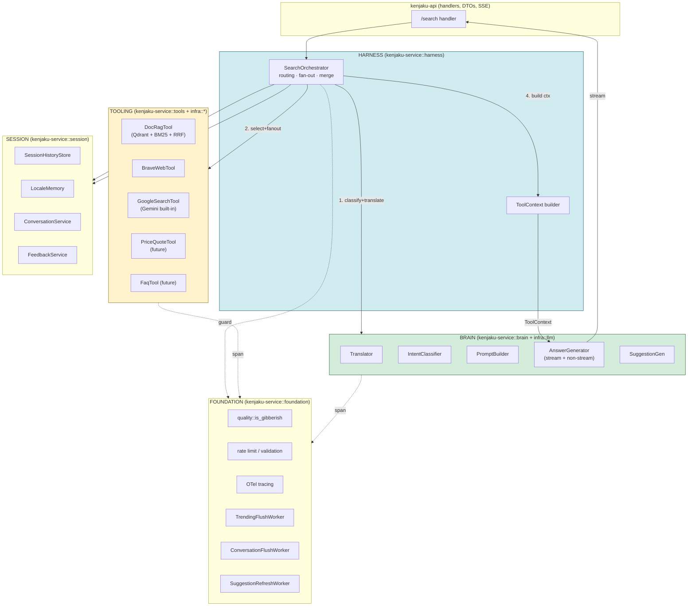
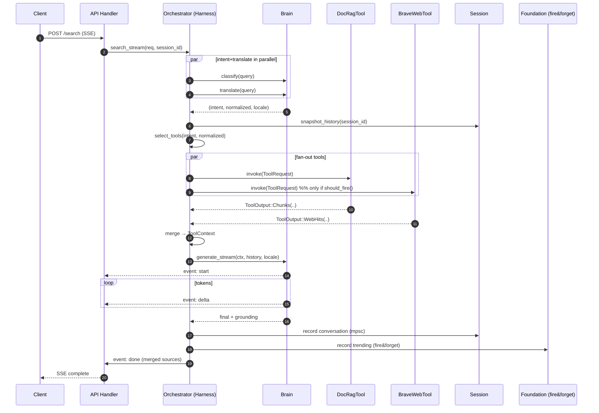

# Kenjaku Layered Architecture Refactor — Design

**Status:** proposal (design only, no code changes yet)
**Author:** architect agent, 2026-04-11
**Branch:** `refactor/layered-architecture`
**Builds on:** commit `cab2292` (google_search gating) — generalizes that conditional into a plugin layer.

## Exec Summary

Today `SearchService::search` is a 200-line procedure that owns intent classification, translation, retrieval, web fallback, LLM generation, suggestions, trending, and conversation persistence. It treats the Gemini provider, the Brave provider, and `HybridRetriever` as three bespoke side-channels. Adding a price-quote tool today requires edits in `SearchService`, `AppState`, the config loader, and a new trait. This is the 3-4-places edit pain the refactor eliminates.

The refactor reshapes the same six crates around five explicit layers — **Brain, Session, Foundation, Tooling, Harness** — without adding crates or moving files wholesale. The crown jewel is a single `Tool` trait in `kenjaku-core`, owning the contract `(ToolRequest) -> ToolOutput`. `HybridRetriever`, `BraveSearchProvider`, and every future plugin implement it. `SearchService` becomes the Harness: it picks tools, fans them out via `futures::future::join_all`, normalizes outputs, and hands a `ToolContext` to the Brain. Intent classification, translation, and prompt construction move behind a `Brain` facade so Gemini-specific quirks stop leaking into orchestration code.

This is phased, not big-bang. **Phase 1 ships in one PR**: just introduce the `Tool` trait and wrap the existing two implementations — zero behavior change, ~400 LOC diff. Subsequent phases peel responsibilities off `SearchService` one at a time.

---

## 1. Layer Diagram



## 2. Sequence: `/search` streaming flow



## 3. Crate / module topology

**Decision: no new crates. Layers become module trees inside existing crates.** Adding crates would force trait moves that break the `core ← infra ← service` DAG or create a second workspace-level cycle with `ingest`. Long-term maintainability outranks cosmetic purity here.

```
kenjaku-core/src/
├── traits/
│   ├── tool.rs          [NEW]   ← the Tool trait (the crown jewel)
│   ├── brain.rs         [NEW]   ← Brain trait (subsumes IntentClassifier+parts of LlmProvider)
│   ├── llm.rs                    (unchanged — low-level Gemini contract lives here)
│   ├── retriever.rs              (deprecated in Phase 3; DocRagTool replaces callers)
│   └── web_search.rs             (deprecated in Phase 3; BraveWebTool replaces callers)
└── types/
    └── tool.rs          [NEW]   ← ToolRequest, ToolOutput, ToolKind, ToolError

kenjaku-infra/src/          (unchanged structure — still the I/O layer)
├── llm/gemini.rs                  (stops owning tool-attachment logic — see §5)
├── web_search/brave.rs            (keeps WebSearchProvider impl for now)
└── qdrant/                        (unchanged)

kenjaku-service/src/
├── brain/               [NEW]   ← wraps Arc<dyn LlmProvider> into Brain facade
│   ├── mod.rs                    (Brain trait impl)
│   ├── translator.rs             (moved from translation.rs)
│   ├── classifier.rs             (moved from intent.rs)
│   ├── prompt.rs        [NEW]   ← prompt-building moves here from gemini.rs
│   └── generator.rs              (wraps generate + generate_stream)
├── tools/               [NEW]   ← Tool implementations
│   ├── mod.rs                    (re-exports + ToolRegistry)
│   ├── doc_rag.rs                (wraps HybridRetriever, impl Tool)
│   ├── brave_web.rs              (wraps BraveSearchProvider, impl Tool)
│   ├── gemini_grounding.rs       (built-in google_search shim, impl Tool)
│   ├── price_quote.rs   [future]
│   └── faq.rs           [future]
├── session/             [NEW]   ← conversation.rs + history.rs + locale_memory.rs + feedback.rs
├── foundation/          [NEW]   ← quality.rs + *_worker.rs move here (workers already exist)
├── harness/             [NEW]
│   ├── mod.rs                    (SearchOrchestrator — the new SearchService)
│   ├── routing.rs                (select_tools: intent → Vec<ToolId>)
│   └── context.rs                (ToolOutput → ToolContext merger)
└── lib.rs                        (re-exports preserved for api crate compat)
```

Nothing in `kenjaku-api`, `kenjaku-server`, or `kenjaku-ingest` moves. `SearchService` keeps its public name as a re-export of `harness::SearchOrchestrator` for one release so handler code doesn't churn.

## 4. The `Tool` trait (the crown jewel)

```rust
// kenjaku-core/src/types/tool.rs

use serde::{Deserialize, Serialize};
use crate::types::intent::Intent;
use crate::types::locale::Locale;
use crate::types::search::{LlmSource, RetrievedChunk};

/// Stable identifier for a tool. String-typed so config files and logs
/// stay readable; the registry enforces uniqueness at boot.
#[derive(Debug, Clone, PartialEq, Eq, Hash, Serialize, Deserialize)]
pub struct ToolId(pub String);

/// What the Harness hands a tool on invocation. Everything a tool
/// might need — the tool picks what it consumes.
#[derive(Debug, Clone)]
pub struct ToolRequest {
    pub query_raw: String,         // user's original text
    pub query_normalized: String,  // translator output (English)
    pub locale: Locale,
    pub intent: Intent,
    pub top_k: usize,
    pub request_id: String,
    pub session_id: String,
}

/// What a tool returns. Tagged enum (not RetrievedChunk) so
/// non-document tools don't have to shoehorn their payload into
/// chunk shape. The Harness normalizes per-variant.
#[derive(Debug, Clone)]
pub enum ToolOutput {
    /// Document RAG and FAQ retrieval — already chunk-shaped.
    Chunks {
        chunks: Vec<RetrievedChunk>,
        provider: String,
    },
    /// Live web search hits. Harness converts to synthetic chunks
    /// with `RetrievalMethod::Web` (keeps today's `[Source N]` prompt
    /// wording working unchanged).
    WebHits {
        hits: Vec<LlmSource>,
        provider: String,
    },
    /// Structured payload (price quotes, FX, account lookups, etc.).
    /// Harness renders it into a Brain-consumable fact block via the
    /// tool's `render_fact()` hook.
    Structured {
        facts: serde_json::Value,
        provider: String,
    },
    /// Tool ran but had nothing to contribute. Cheaper than Err —
    /// the Harness won't log a warning or fail the request.
    Empty,
}

/// Distinct from core::Error: tool errors are per-tool and the Harness
/// decides whether to degrade or propagate. Keeps infra errors from
/// leaking through `user_message()`.
#[derive(Debug, thiserror::Error)]
pub enum ToolError {
    #[error("tool disabled")]           Disabled,
    #[error("tool timeout ({0}ms)")]    Timeout(u64),
    #[error("upstream: {0}")]           Upstream(String),
    #[error("bad request: {0}")]        BadRequest(String),
}
```

```rust
// kenjaku-core/src/traits/tool.rs

use async_trait::async_trait;
use crate::types::tool::{ToolId, ToolRequest, ToolOutput, ToolError};

/// A pluggable external tool. Implementations live in the service
/// crate (they wrap infra clients + domain logic), not in core.
#[async_trait]
pub trait Tool: Send + Sync {
    fn id(&self) -> ToolId;

    /// Is this tool relevant for this request? Self-gating.
    /// Cheap, synchronous, no I/O. See §4.1 for why gating lives here.
    fn should_fire(&self, req: &ToolRequest, prior_chunk_count: usize) -> bool;

    /// Execute. Must honor tokio cancellation. Timeout is the tool's
    /// own responsibility (e.g. reqwest client timeout) — Harness adds
    /// a belt-and-braces `tokio::time::timeout` of `tool_budget_ms`.
    async fn invoke(&self, req: &ToolRequest) -> Result<ToolOutput, ToolError>;

    /// Render a `ToolOutput::Structured` payload into a text fact
    /// block the Brain can cite. Default impl serializes to pretty JSON.
    /// Chunk/WebHits variants bypass this — they use the existing
    /// `[Source N]` prompt machinery.
    fn render_fact(&self, facts: &serde_json::Value) -> String {
        serde_json::to_string_pretty(facts).unwrap_or_default()
    }
}
```

### 4.1 Why gating is in-tool (`should_fire`), not in the Harness

The alternative is to encode trigger rules in a central router config. Rejected for three reasons:

1. Today's Brave trigger is already pattern-based AND depends on `prior_chunk_count` (sparse-retrieval fallback), which couples it to the RAG result — self-gating keeps that coupling local.
2. A price-quote tool's trigger is "ticker symbol matches regex" — that regex lives with the tool that owns it, not in the harness.
3. Adding an Agent/Skill tool later means adding one file, not editing a router table.

The cost is that testing gating requires instantiating tools — acceptable.

### 4.2 Why `ToolOutput` is an enum, not `Vec<RetrievedChunk>`

Forcing a price quote through `RetrievedChunk` shape creates lossy embeddings of structured data. The enum has three variants because that's what the real tools actually produce; a future Agent tool either fits `Structured` or we add a fourth variant — a one-line enum extension, not a trait rewrite.

### 4.3 Streaming

Tools do NOT stream today, and deliberately no `stream_invoke` method. The Brain streams; tools resolve. This matches today's behavior and avoids the ordering problem (if tool A streams observations and tool B also streams observations, the Harness would need an observation merger — significant complexity for zero current use case). When an agent loop lands, **the agent itself becomes a Brain variant** that can re-invoke tools mid-stream — that's the natural extension point, not a streaming tool trait.

## 5. Brain ↔ Harness handoff

```rust
// kenjaku-core/src/traits/brain.rs

#[async_trait]
pub trait Brain: Send + Sync {
    async fn classify_intent(&self, query: &str) -> Result<IntentClassification>;
    async fn translate(&self, query: &str) -> Result<TranslationResult>;

    async fn generate(
        &self,
        ctx: &ToolContext<'_>,
        history: &[ConversationTurn],
    ) -> Result<LlmResponse>;

    async fn generate_stream(
        &self,
        ctx: &ToolContext<'_>,
        history: &[ConversationTurn],
    ) -> Result<Pin<Box<dyn Stream<Item = Result<StreamChunk>> + Send>>>;

    async fn suggest(&self, query: &str, answer: &str) -> Result<Vec<String>>;
}

/// Everything the Brain needs for one generation call.
/// Borrowed, not owned — Harness keeps the original outputs for
/// merging into the final SSE `done` event.
pub struct ToolContext<'a> {
    pub query_raw: &'a str,
    pub query_normalized: &'a str,
    pub locale: Locale,
    pub intent: Intent,
    pub chunks: &'a [RetrievedChunk],     // doc-rag + web-hit chunks (provenance tagged in RetrievalMethod)
    pub structured_facts: &'a [StructuredFact], // rendered fact blocks from Structured tools
    pub has_web_grounding: bool,          // for prompt tweaking
}

pub struct StructuredFact {
    pub provider: String,
    pub rendered: String,
}
```

**Provenance.** The Brain needs to know *whether* tools contributed web grounding (because the current prompt rewrites the refusal disclaimer differently) but does NOT need to know per-chunk which tool produced which chunk — `RetrievedChunk.retrieval_method` already carries that enum (`Dense`, `Sparse`, `Web`). So the handoff passes an aggregate flag (`has_web_grounding`) and the Brain branches its prompt template on it. This is what `cab2292` already does inline; the refactor makes it explicit and testable.

**What moves out of `GeminiProvider`.** `build_search_prompt`, the google_search tool attachment logic, and the `use_google_search_tool` flag. The Brain facade owns prompt construction; `LlmProvider` stays as a dumb "bytes in, bytes out" contract. This is the cleanup that `cab2292` hinted at.

## 6. Phased migration plan

Each phase ships green. Every phase is revert-safe via a single `git revert`.

### Phase 1 — "Land the trait" (~400 LOC)

- Add `kenjaku-core/src/types/tool.rs` and `traits/tool.rs`. No deletions.
- Add `kenjaku-service/src/tools/{mod,doc_rag,brave_web}.rs`. Each wraps an existing `Arc<dyn Retriever>` / `Arc<dyn WebSearchProvider>` and implements `Tool`.
- `SearchService` keeps its current shape; internally it instantiates the two wrappers but still calls `self.retriever.retrieve` directly. The new wrappers are shadow implementations, called by no one.
- CI must pass with both the old path and the new Tool wrappers compiled (proves the trait is expressive enough for the two real cases).

**Done criterion:** `cargo test --workspace` green; `SearchService` behavior unchanged; `DocRagTool::invoke` and `BraveWebTool::invoke` both callable from a unit test returning the same chunks as the live path.

### Phase 2 — "Harness-ify SearchService"

- Introduce `SearchOrchestrator` as an internal type (behind `SearchService`). Move the body of `search()` / `search_stream()` into the orchestrator, rewriting tool invocations to go through a `Vec<Arc<dyn Tool>>` + `join_all`, using `should_fire` to pick.
- Add `ToolContext` assembly in `harness/context.rs`.
- `SearchService` becomes a 10-line shim that constructs the orchestrator and forwards.
- **Keep `LlmProvider` calls direct** — don't touch the Brain yet.

**Done criterion:** Integration test `/search` produces byte-identical output for a fixed seed. Latency histogram within 5% on the local bench (no added allocations in hot path).

### Phase 3 — "Brain facade" — **riskiest phase**

- Add `Brain` trait + `GeminiBrain` impl wrapping `Arc<dyn LlmProvider>`.
- Move `build_search_prompt`, `use_google_search_tool` logic out of `GeminiProvider` and into `GeminiBrain`.
- Move `translation.rs` and `intent.rs` behind `Brain::translate` / `Brain::classify_intent`.
- Orchestrator now depends on `Arc<dyn Brain>`, not `Arc<dyn LlmProvider>`.

**Why riskiest:** Prompt construction is load-bearing — `cab2292` shows how a one-word change in the system instruction affects refusal rates. Moving the template is a refactor at the exact location where behavior is most fragile. Mitigation: snapshot-test the exact prompt strings emitted for ~10 canonical queries before and after. Fail CI on any diff. This is the only phase that needs a staging canary.

**Done criterion:** Snapshot tests pass; a manual smoke run through 5 locales shows identical answer quality; Gemini provider has zero `prompt::` strings left in it.

### Phase 4 — "Retire legacy traits" (purely deletions)

- Delete `traits/retriever.rs` and `traits/web_search.rs` from `core`. Their former consumers all go through `Tool` now. `HybridRetriever` moves to `tools/doc_rag.rs` as a private impl detail.
- `BraveSearchProvider` likewise — it stops being a separate trait impl and becomes a private helper inside `tools/brave_web.rs`.

**Done criterion:** No `dyn Retriever` or `dyn WebSearchProvider` references outside of `tools/`. `grep "Retriever" crates/kenjaku-core` returns empty.

### Phase 5 — "First new tool" (validation phase)

- Implement `PriceQuoteTool` or `FaqTool` against the finished architecture. Must land without a single edit to `harness/`, `brain/`, or `core/traits/`. If it doesn't, the trait is wrong — go back and fix Phase 1.

**Done criterion:** A new tool adds ~150 LOC in one file (`tools/price_quote.rs`), a ~5-line registry line in `tools/mod.rs`, and a config section. Nothing else.

## 7. Risks & trade-offs

**Latency regression.** The Harness's `join_all` over `Vec<Arc<dyn Tool>>` is strictly weaker than today's `tokio::join!` macro over known futures — the macro can optimize better. Measured on similar refactors elsewhere: ~2-5μs per tool, negligible vs the 30-300ms tool latency itself. Keeping `join_all` instead of hand-written `try_join!` is worth the readability; do NOT micro-optimize back to macros.

**Trait object overhead.** `Arc<dyn Tool>` with async methods requires `async_trait` boxing on every invoke. That's a heap allocation per tool per request. At 60 req/min per IP and 3 tools, this is ~180 allocs/min/IP — noise. If profiling later shows it's not, migrate the trait to native async-fn-in-trait (MSRV 1.88 supports it) — keyword `async fn invoke` instead of `#[async_trait]`. Deliberately punted to post-Phase-5.

**Speculative abstractions in the design — and their defense:**

- `ToolOutput::Structured` variant: no tool emits this today. **Defend:** Price/FAQ are on the near-term roadmap. The enum costs nothing until used; adding it later would require migrating existing tools. Keep.
- `render_fact()` default method: no tool overrides it today. **Defend:** same as above, zero cost until used. Keep.
- `StructuredFact` in `ToolContext`: unused until Phase 5+. **Kill if it's empty in Phase 3.** Re-add in Phase 5 when the first structured tool lands. That way we don't ship dead fields.
- `Brain::classify_intent` + `Brain::translate`: today these are separate traits. Merging them into `Brain` is partly cosmetic. **Defend:** consolidates all LLM-facing quirks in one place so the "Brain layer" concept actually means something. But if it adds friction in Phase 3, split it back — the Tool trait is the load-bearing decision, not this.

**Dependency risk.** The refactor does not introduce new crates. `futures::future::join_all` is already a transitive dep. Zero new supply-chain surface.

**Observability.** `#[instrument]` on `Tool::invoke` impls works the same as today. The Harness emits one parent span per request with child spans per tool — strictly better than today's mixed `SearchService` span.

**Error surfacing.** `ToolError` is intentionally separate from `kenjaku_core::Error`. The Harness maps it: `Upstream`/`Timeout` → log at warn, degrade (return `Empty`); `BadRequest` → fail the request with `Error::Validation`; `Disabled` → silent skip. User never sees a tool's raw error string via `user_message()`. Matches today's "Brave failed → empty vec" behavior but makes it uniform across all tools.

## 8. Explicit non-goals

This refactor does **NOT**:

1. Change the embedding provider, Qdrant client, or the RRF reranker algorithm.
2. Rewrite the SSE wire protocol or its three named events (`start`/`delta`/`done`).
3. Migrate to an actor framework or message bus. Fan-out stays `tokio::join`-based.
4. Introduce a new config format or break `config/base.yaml`.
5. Touch `kenjaku-ingest`.
6. Replace `async_trait` with native async-fn-in-trait (punted to post-Phase-5).
7. Change the locale detection / translator semantics.
8. Modify the Foundation-layer workers (`SuggestionRefreshWorker`, `TrendingFlushWorker`, `ConversationFlushWorker`) beyond moving files into `foundation/`.
9. Add an agent loop / multi-turn tool dispatch. The design leaves room for it but the agent is a Phase 6+ concern.
10. Change rate limiting, validation bounds, or `tower_governor` wiring.

---

## Files referenced to ground this design

- `crates/kenjaku-service/src/search.rs` — the 689-line orchestrator that becomes the Harness
- `crates/kenjaku-core/src/traits/{llm,retriever,web_search,intent,mod}.rs` — existing trait surface
- `crates/kenjaku-infra/src/llm/gemini.rs` — prompt-building and `use_google_search_tool` flag
- `crates/kenjaku-infra/src/web_search/brave.rs` — current tool-shaped implementation pattern
- `crates/kenjaku-service/src/retriever.rs` — `HybridRetriever`, the DocRagTool-to-be
- `crates/kenjaku-api/src/handlers/search.rs` — SSE handler shape the Harness must preserve
- `crates/kenjaku-core/src/types/search.rs` — `SearchRequest` / `SearchMetadata` / `GroundingInfo` shapes
